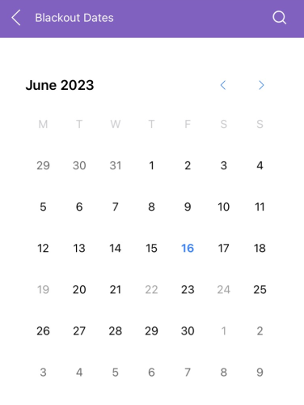

# .NET MAUI Calendar Blackout Dates

The Calendar component for .NET MAUI provides a simple way to disable specific dates. To take advantage of this feature, specify the `BlackoutDates`(`IEnumerable&lt;DateTime&gt;`) collection and the user will not be able to select the defined dates.

## Disabled (Blackout) Dates Example

The following snippets show how to disable certain dates in Calendar control.

**1.** Define the `RadCalendar` control in XAML.

<snippet id='calendar-blackout-dates'/>

**2.** Add a VieWModel with defined blackout dates. 

<snippet id='calendar-blackoutdates-viewmode'/>

> For the complete example with the Calendar Blackout dates, see the [SDKBrowser Demo Application]() and go to the **Calendar > Features** category.

## See Also

- [Navigation Between the Different Views]()
- [Specify the Formatting]()
- [Selection modes]() 
- [Use exposed Events]()
- [Use the exposed Commands]()
- [Define Templates]()
- [Calendar Header Styling]()
