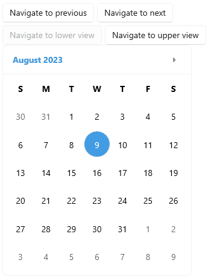

# .NET MAUI Calendar Commands

The .NET MAUI Calendar provides various commands that allow the user to switch between the display modes and views.

## Commands for Navigating the Current View

The following commands enable the navigation between same level views:

* `NavigateToNextViewCommand`(`ICommand`)&mdash;Gets the command that is executed when the user navigates to the next view.
* `NavigateToPreviousViewCommand`(`ICommand`)&mdash;Gets the command that is executed when the user navigates to the previous view.

## Commands for Navigating between Views

The following commands enable the navigation between the view levels: 

* `NavigateToUpperViewCommand`(`ICommand`)&mdash;Gets the command that is executed when the user navigates to the upper view.
* `NavigateToLowerViewCommand`(`ICommand`)&mdash;Gets the command that is executed when the user navigates to the lower view..

When switching between view levels, the Calendar implements the following navigation sequence:

* When navigating to the upper view: Month > Year > Decade > Century.
* When navigating to the lower view: Century > Decade > Year > Month.

## Navigation Example

**1.** Define the Calendar:

<snippet id='calendar-navigation-commands'/>

**2.** Execute the `NavigateToNextViewCommand` and `NavigateToPreviousViewCommand` on button click:

<snippet id='calendar-navigating-in-current-view'/>

**3.** Execute the `NavigateToUpperViewCommand` and `NavigateToLowerViewCommand` on button click:

<snippet id='calendar-navigating-detween-views'/>

> For a runnable example demonstrating the Calendar Commands, see the [SDKBrowser Demo Application]() and go to the **Calendar > Commands** category.

## See Also

- [Navigation Between the Different Views]()
- [Specify the Formatting]()
- [Selection modes]() 
- [Use exposed Events]()
- [Define Templates]()