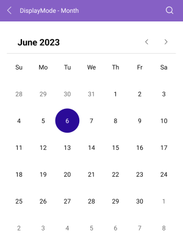
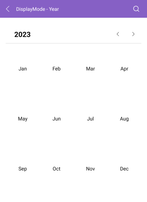
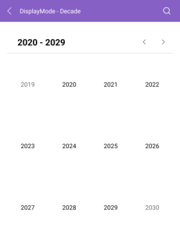

# .NET MAUI Calendar Display Modes

The Telerik <a href="https://www.telerik.com/maui-ui/calendar" target="_blank">.NET MAUI Calendar</a> is a control that allows the user to select a date from a standard view that can represent various time spans. The Calendar views define what is visible in the Calendar, for example, month, year, decade, or century.

## Setting the Display Mode Programmatically

The `DisplayMode` property (enum of type `Telerik.Maui.Controls.Calendar.CalendarDisplayMode`) defines the current view of the `RadCalendar` control. The available display modes are:

* `Month` (Default)
* `Year`
* `Decade`
* `Century`

## Changing the Display Mode through the UI

The user can effortlessly change the `DisplayMode` through the UI by tapping (for mobile) or clicking (for desktop) the header text.

## Setting Min and Max Display Mode

You can define a range of display modes that will be available to the user through the following properties:

* `MinDisplayMode` (enum of type `Telerik.Maui.Controls.Calendar.CalendarDisplayMode`)&mdash;Specifies the minimum display mode of the Calendar. The available options are `Month`, `Year`, `Decade`, and `Century`. When `MinDisplayMode` is `Year`, users can select months from this year.
* `MaxDisplayMode` (enum of type `Telerik.Maui.Controls.Calendar.CalendarDisplayMode`)&mdash;Specifies the maximum display mode of the Calendar. The available options are `Month`, `Year`, `Decade`, and `Century`.

<snippet id='calendar-display-range'/>

## Month View

The month view represents all days in a single month.

<snippet id='calendar-displaymode-month'/>

## Year View

The year view represents all months in a year.

<snippet id='calendar-displaymode-year'/>

## Decade View

The decade view represents all years in a decade.

<snippet id='calendar-displaymode-decade'/>

## Century View

The century view represents all decades in a century.

<snippet id='calendar-displaymode-century'/>

> For all examples with the display modes of the Calendar, check the [SDKBrowser Demo Application]() and go to **Calendar > Display Modes** category.

## See Also

- [Navigation Between the Different Views]()
- [Specify the Formatting]()
- [Selection modes]() 
- [Use exposed Events]()
- [Use the exposed Commands]()
- [Define Templates]()
- [Calendar Header Styling]()
