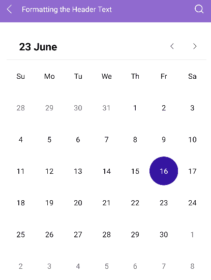

# .NET MAUI Calendar Header Text Formatting

The <a href="https://www.telerik.com/maui-ui/calendar" target="_blank">.NET MAUI Calendar</a> allows you to specify the format of the header label text in the different display modes. The format must be a valid date format. The available options for the header label text formatting are: 

* `MonthHeaderTextFormat`(`string`)&mdash;Specifies the format of the header text when the Calendar `DisplayMode` is `Month`.
* `YearHeaderTextFormat`(`string`)&mdash;Specifies the format of the header text when the Calendar `DisplayMode` is `Year`.
* `DecadeHeaderTextFormat`(`string`)&mdash;Specifies the format of the header text when the Calendar `DisplayMode` is `Decade`.
* `CenturyHeaderTextFormat`(`string`)&mdash;Specifies the format of the header text when the Calendar `DisplayMode` is `Century`.

## Header Text Format Example

The following example demonstrates how to define a Calendar and format the header text with the `MonthHeaderTextFormat`, `YearHeaderTextFormat`, `DecadeHeaderTextFormat`, and `CenturyHeaderTextFormat` properties:

<snippet id='calendar-headertext-formatting'/>

## See Also

- [Navigation Between the Different Views]()
- [Specify the Formatting]()
- [Selection modes]()
- [Use the exposed Commands]()
- [Define Templates]()
- [Calendar Header Styling]()