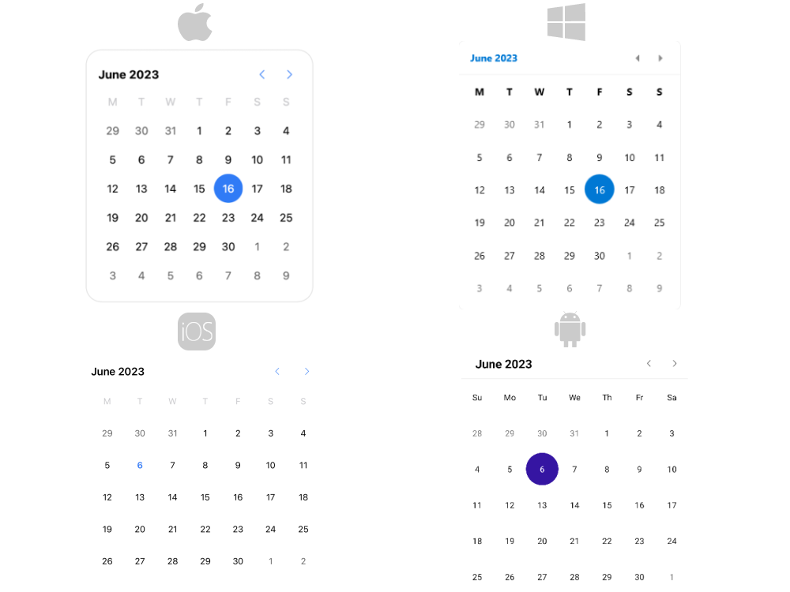

# Getting Started with the .NET MAUI Calendar

This guide provides the information you need to start using the Telerik UI for .NET MAUI Calendar by adding the control to your project.

At the end, you will be able to achieve the following result.



## Prerequisites

Before adding the Calendar, you need to:

1. [Set up your .NET MAUI application](#step-1-set-up-your-net-maui-application).

1. [Download Telerik UI for .NET MAUI](#step-2-download-telerik-ui-for-net-maui).

1. [Install Telerik UI for .NET MAUI](#step-3-install-telerik-ui-for-net-maui).

1. [Register Required Handlers](#step-4-register-required-handlers).

## Define the Control

When your .NET MAUI application is setup, you are ready to add a Calendar control to your page. The following example demonstrates the definition of the `RadCalendar`:

<snippet id='calendar-getting-started-xaml'/>
<snippet id='calendar-gettingstarted-csharp'/>

Add the `telerik` namespaces:

```XAML
xmlns:telerik="http://schemas.telerik.com/2022/xaml/maui"
```

Register the Telerik controls through the `Telerik.Maui.Controls.Compatibility.UseTelerik` extension method called inside the `CreateMauiApp` method of the `MauiProgram.cs` file of your project:

```C#
using Telerik.Maui.Controls.Compatibility;

public static class MauiProgram
{
	public static MauiApp CreateMauiApp()
	{
		var builder = MauiApp.CreateBuilder();
		builder
			.UseTelerik()
			.UseMauiApp<App>()
			.ConfigureFonts(fonts =>
			{
				fonts.AddFont("OpenSans-Regular.ttf", "OpenSansRegular");
			});

		return builder.Build();
	}
}           
```

>important For the Calendar Getting Started example refer to the [SDKBrowser Demo Application]() Calendar -> Getting Started category.

## Additional Resources

- [.NET MAUI Calendar Product Page](https://www.telerik.com/maui-ui/calendar)
- [.NET MAUI Calendar Forum Page](https://www.telerik.com/forums/maui?tagId=1937)
- [Telerik .NET MAUI Blogs](https://www.telerik.com/blogs/mobile-net-maui)
- [Telerik .NET MAUI Roadmap](https://www.telerik.com/support/whats-new/maui-ui/roadmap)

## See Also

- [Date properties]()
- [Navigation]()
- [Selection modes]() 
- [Events]()
- [Commands]()
- [Templates]()
- [Styling]()
