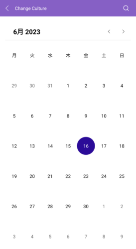

# .NET MAUI Calendar Globalization

Globalization refers to developing an application in such a way that it works on the target device culture. This includes changes in the Calendar day names and first day of week.

The Telerik UI for <a href="https://www.telerik.com/maui-ui/calendar" target="_blank">.NET MAUI Calendar</a> control supports globalization through the `Culture` property (of type `System.Globalization.CultureInfo`).

The following example demonstrates how to set the desired culture in the `RadCalendar`:

**1.** Define the `RadCalendar` in XAML:

<snippet id='calendar-culture'/>

**2.** Add the namespace:

```XAML
xmlns:telerik="http://schemas.telerik.com/2022/xaml/maui"
```

**3.** Set the desired culture in the code-behind:

<snippet id='calendar-setting-culture'/>

This is the result:



> For a runnable example demonstrating how to configure the Calendar Culture, see the [SDKBrowser Demo Application]() and go to the **Calendar > Features** category.

## See Also

- [Navigation]()
- [Display modes]()
- [Formatting]()
- [Selection modes]() 
- [Events]()
- [Commands]()
- [Templates]()
- [Styling]()