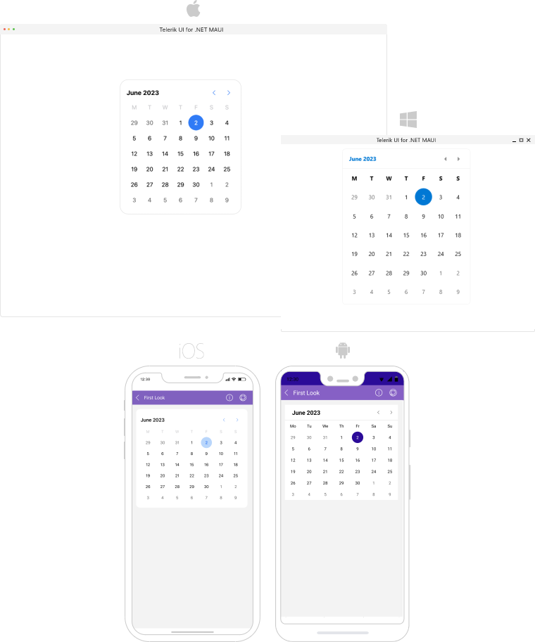

# .NET MAUI Calendar Overview

**Telerik UI for .NET MAUI Calendar** allows you to select single or multiple dates by navigating easily between decades, years, months. The control is culture aware by providing globalization support for all .NET calendar implementations. You can easily customize its look by using the Flexible Styling API and exposed templates. 

## Key Features

* [Different display modes]()&mdash;Calendar features year, month, decade and century display modes.
* [Date Ranges]()&mdash;Restrict the visible/selectable dates in Calendar by utilizing `MinDate` and `MaxDate` properties. 
* [Different selection modes]()&mdash;Calendar provides different types of selection: Single, Multiple, Range or disabling the selection. The selected dates can be changed programmatically or when the user taps on a calendar date cell.
* [Buttons for navigation in the current view]()&mdash;Easily navigate in the current view by using the buttons in the calendar header.
* [Hide the names of the display days in month view](#day0names-visibiliy%}).
* [Format the header text for the corresponding view]().
* [Templates]()&mdash;For customizing how the days, months, years and decades in the corresponding views.
* [Commands support]()&mdash;For navigating in the current view or between the views.
* [Stye]() the Calendar border, header border and text, navigation buttons and the content of the corresponding view.

## Next Steps

- [Getting Started with Telerik UI for .NET MAUI Calendar]()

## See Also

- [.NET MAUI Calendar Product Page](https://www.telerik.com/maui-ui/calendar)
- [.NET MAUI Calendar Forum Page](https://www.telerik.com/forums/maui?tagId=1937)
- [Telerik .NET MAUI Blogs](https://www.telerik.com/blogs/mobile-net-maui)
- [Telerik .NET MAUI Roadmap](https://www.telerik.com/support/whats-new/maui-ui/roadmap)
