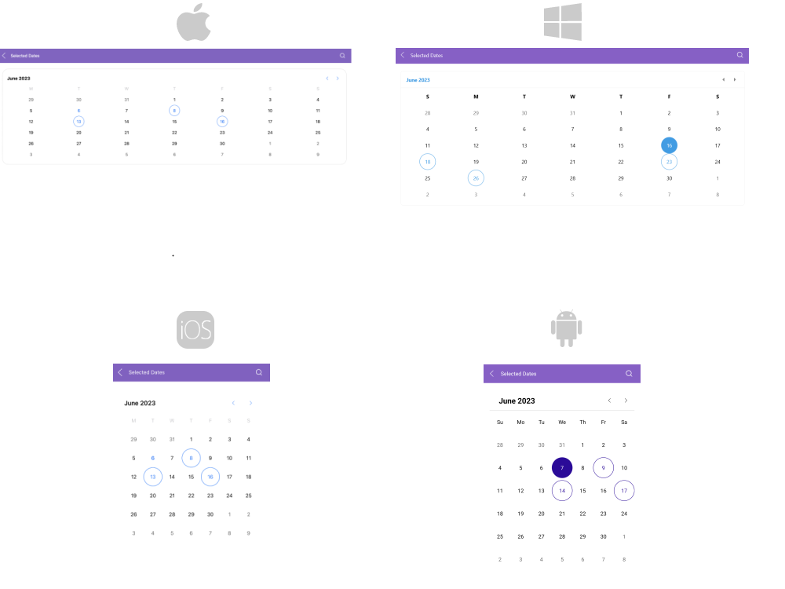
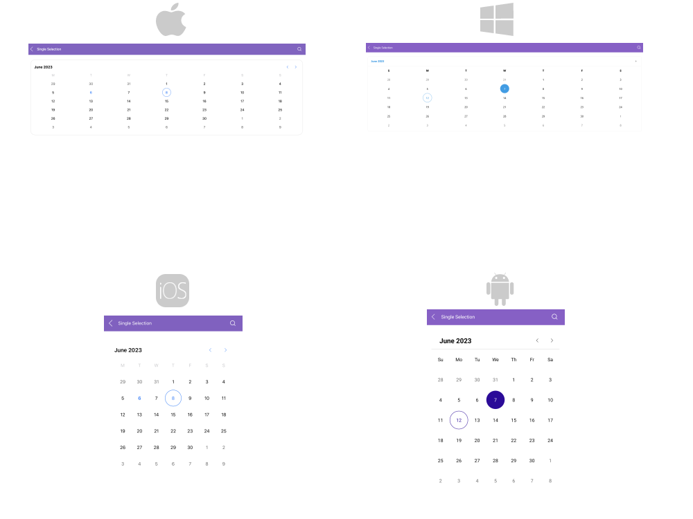
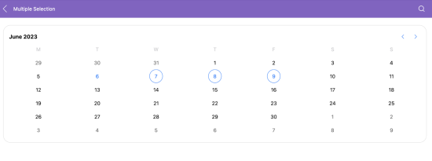
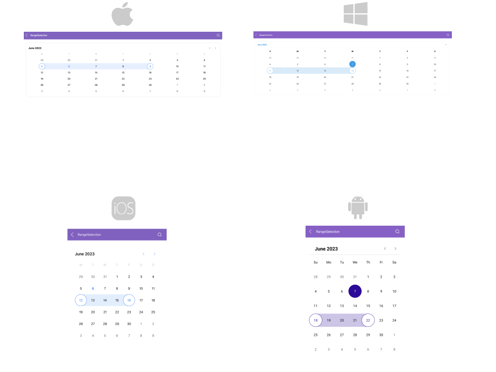

# .NET MAUI Calendar Selection

Calendar for .NET MAUI provides three different types of selection: Single, Multiple, and Range. The selected dates can be changed programmatically or by tapping a calendar cell.

## Changing the Selection Mode

The selection modes of the Calendar allow you to determine if the user can select a single date, date span, multiple dates, or to disable date selection. To change the selection mode, use the `SelectionMode` class:

* `SelectionMode` (enumeration of type `Telerik.Maui.Controls.Calendar.CalendarSelectionMode`)&mdash;Specifies the selection applied to the Calendar control. You can choose one of the following options:
	* `None`&mdash;Selection is disabled and the user cannot select any dates in the Calendar.
	* `Single` (Default)&mdash;Allows the selection of a single date. When tapping or clicking on a date cell, it becomes selected. Any previously selected cell is deselected.
	* `Multiple`&mdash;Allows the selection of multiple dates. Tapping or clicking each date cell changes its selection state. The first tap or click adds the target date cell to the current selection, and a next tap or click removes the target cell from the selection.
	* `Range`&mdash;Allows the users to pick a range of consecutive dates. The first date cell that is tapped gets selected and becomes the start of the range. The next cell that is tapped becomes the end of the range. All dates between the range start the end become selected.

## Changing the Selected Date

To change the selected date in the .NET MAUI Calendar, use the `SelectedDate` and `SelectedDates` properties:

* `SelectedDate`(`DateTime?`)&mdash;Specifies the currently selected date. When using `Multiple` or `Range` selection, the value of the `SelectedDate` property is set to the first selected date.
* `SelectedDates`(`readonly ObservableCollection<DateTime>`)&mdash;Gets the collection with the currently selected dates. When the `SelectionMode` is `Single`, only one date is added in the collection.

## Examples

The examples below demonstrate how to set the [selected dates](#selected-dates-example), apply Single, Multiple, and Range selection.

### Selected Dates Example

**1.** Define the .NET MAUI Calendar:

<snippet id='calendar-selection-properties'/>

**2.** Declare the ViewModel:

<snippet id='calendar-selection-viewmodel'/>

The image below shows the result:

### Single Selection Example

Define a .NET MAUI Calendar with `SelectionMode="Single"`:

<snippet id='calendar-single-selection'/>

The image below shows how single selection looks:

### Multiple Selection Example

Define a .NET MAUI Calendar with `SelectionMode="Multiple"`:

<snippet id='calendar-multiple-selection'/>

The image below shows how multiple selection looks:

### Range Selection Example

Define a .NET MAUI Calendar with `SelectionMode="Range"`:

<snippet id='calendar-range-selection'/>

The image below shows how range selection looks: 

### Disabled Selection Example

Define a .NET MAUI Calendar with `SelectionMode="None"`:

<snippet id='calendar-disabled-selection'/>

> For a runnable example demonstrating the selection in the Calendar, see the [SDKBrowser Demo Application]() and go to the **Calendar > Selection** category.

## Selection Change Events

The Calendar exposes a `SelectionChanged` event which is invoked when performing selection. The `SelectionChanged` event handler receives two parameters:

* The `sender` parameter, which is the `RadCalendar` control.
* The `CalendarSelectionChangedEventArgs` parameter, which provides the following properties:
	* `RemovedDates`&mdash;The deselected dates.
	* `AddedDates`&mdash;The selected dates.

The following example demonstrates how to use the `SelectionChanged` event:

**1.** Define a .NET MAUI Calendar:

<snippet id='calendar-selection-event'/>

**2.** Add the event handler:

<snippet id='calendar-selection-changed-event'/>

## See Also

- [Navigation Between the Different Views]()
- [Specify the Formatting]()
- [Selection modes]()
- [Use the exposed Commands]()
- [Define Templates]()
- [Calendar Header Styling]()