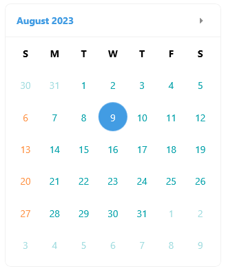

# .NET MAUI Calendar Day Styling

Use the .NET MAUI Calendar day styling API to customize both the day-of-week headers in the month view and the individual day cells. Choose `DayNameLabelStyle` when you want one style for all day names, and use `DayStyleSelector` when different days need different styles.

## Style the Day Names in the Month View

Use `DayNameLabelStyle` (`Style` with target type `Label`) to apply the same appearance to all day names in the month view. This property affects the day headers only. It does not style the individual date cells.

The following example shows how to style the day names:

1. Define the Calendar

<snippet id='calendar-daynames-styling'/>

2. Define the Day Name Style

<snippet id='calendar-daynamelabel-style'/>

>tip
> For a runnable example that styles Calendar day names, see the [SDKBrowser Demo Application]() and go to **Calendar > Styling**.

## Style Individual Day Cells with a Style Selector

Use `DayStyleSelector` when you need to apply different styles to different days in the month view. This approach is useful when you want to highlight weekends, special dates, unavailable days, or other dates that match custom rules.

The `DayStyleSelector` property is of type `CalendarStyleSelector` and selects the style for each day cell in the month view.

The following example shows how to style day cells with `DayStyleSelector`:

1. Define the Calendar

<snippet id='calendar-styleselectors-daystyleselector-usage'/>

2. Define the Styles in the Page Resources

<snippet id='calendar-styleselectors-daystyleselector-definition'/>

3. Add the `CustomStyleSelector` Class

<snippet id='calendar-styleselectors-custom-calendarstyleselector'/>

The following image shows a Calendar month view with different styles applied to individual day cells:

>tip
> For a runnable example that styles individual Calendar day cells, see the [SDKBrowser Demo Application]() and go to **Calendar > Style Selector**.

## See Also

- [Decade Styling]()
- [Header Styling]()
- [Month Styling]()
- [Year Styling]()
