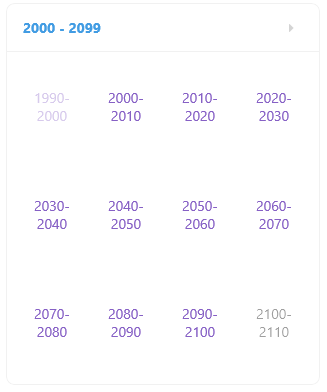

# .NET MAUI Calendar Decade Styling

The Calendar control for .NET MAUI provides the `DecadeStyleSelector`(of type `CalendarStyleSelector`) property which specifies the style selector for the decades in the century view of the calendar.

The following example demonstrates how to style the days with the `DecadeStyleSelector` property:

**1.** Define the Calendar:

<snippet id='calendar-styleselectors-decadestyleselector-usage'/>

**2.** The style selectors defined in the page's resources:

<snippet id='calendar-styleselectors-decadestyleselector-definition'/>

**3.** Add the `CustomStyleSelector` class that inherits from `CalendarStyleSelector`:

<snippet id='calendar-styleselectors-custom-calendarstyleselector'/>

>For a runnable example demonstrating how to style the decades in the Calendar, see the [SDKBrowser Demo Application]() and go to **Calendar > Style Selector**.

## See Also

- [Day Styling]()
- [Header Styling]() 
- [Month Styling]()
- [Year Styling]()
