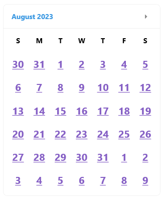
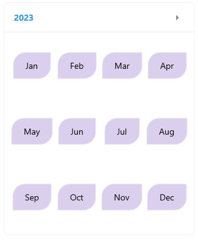
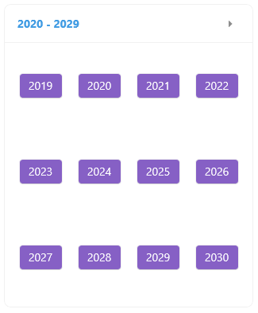
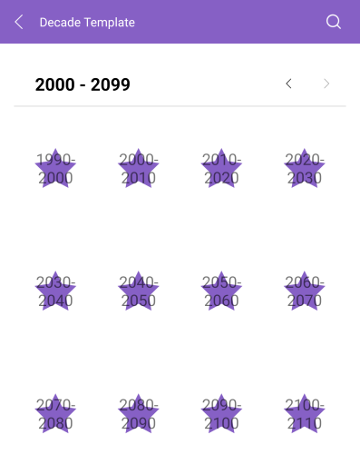
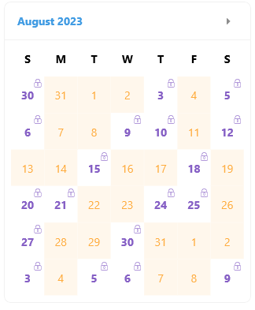

# .NET MAUI Calendar Templates

If the default look how the days, months, years and decades are presented in the <a href="https://www.telerik.com/maui-ui/calendar" target="_blank">.NET MAUI Calendar</a> do not match your use case, you can define custom templates. The available templates for customizing are:

* `DayTemplate `(`DataTemplate`)&mdash;Specifies the content templates for the days in the month view of the Calendar.
* `MonthTemplate `(`DataTemplate`)&mdash;Specifies the content templates for the months in the year view of the Calendar.
* `YearTemplate `(`DataTemplate`)&mdash;Specifies the content templates for the years in the decade view of the Calendar.
* `DecadeTemplate `(`DataTemplate`)&mdash;Specifies the content templates for the decades in the century view of the Calendar.

## Day Template

<snippet id='calendar-templates-daytemplate-usage'/>

Here is a sample day template definition for customizing the days in the `MonthView`.

<snippet id='calendar-templates-daytemplate-definition'/>

## Month Template

<snippet id='calendar-templates-monthtemplate-usage'/>

Here is a sample month template definition for customizing the months in the `YearView`.

<snippet id='calendar-templates-monthtemplate-definition'/>

## Year Template

<snippet id='calendar-templates-yeartemplate-usage'/>

Here is a sample year template definition for customizing the years in the `DecadeView`.

<snippet id='calendar-templates-yeartemplate-definition'/>

## Decade Template

<snippet id='calendar-templates-decadetemplate-usage'/>

Here is a sample decade template definition for customizing the decades in the `CenturyView`.

<snippet id='calendar-templates-decadetemplate-definition'/>

## Template Selectors

You can apply a template selector the calendar templates as they are of type `DataTemplate`. 

The following example demonstrates a `DayTemplate` that uses a Template Selector.

<snippet id='calendar-templates-templateselector-usage'/>

And the template selectors definition

<snippet id='calendar-templates-templateselector-definition'/>

And the Template Selector logic:

<snippet id='calendar-templates-custom-templateselector'/>

>important For the Calendar Templates examples refer to the [SDKBrowser Demo Application]() Calendar -> Templates category.

## See Also

- [Navigation Between the Different Views]()
- [Specify the Formatting]()
- [Selection modes]()
- [Use the exposed Commands]()
- [Calendar Header Styling]()