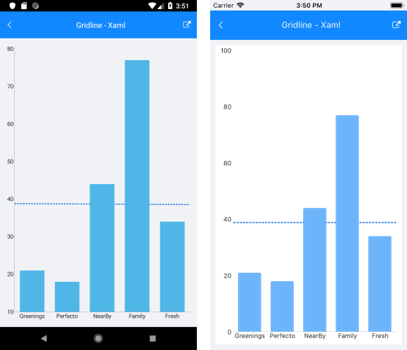
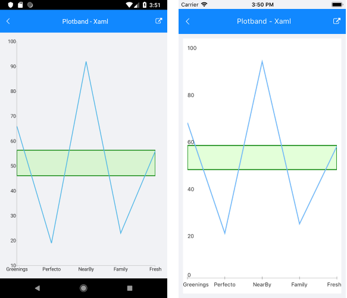

# Annotations

Annotations are visual elements that are used to highlight certain areas on the plot. They can be displayed as comments or as markers for specific values on the plot. You can practically utilize any visual element as a template for the annotation.

The Chart supports the following types of annotations:

- `CartesianGridLineAnnotation`&mdash;This annotation is visually represented by straight lines across the chart that mark specific values on the associated Cartesian axis.
- `CartesianPlotBandAnnotation`&mdash;This annotation is visually represented by a band across the chart that marks a specific range on the associated Cartesian axis.

## CartesianGridLineAnnotation

The `CartesianGridLineAnnotation` represents a vertical or horizontal line that crosses the entire plot area and provides the following features:

- `Axis`&mdash;The `CartesianGridLineAnnotation` has to be explicitly associated with a horizontal or a vertical cartesian axis.
- `Value`&mdash;The place on the associated axis where a line crosses it.

>note When the associated axis is numerical, the `CartesianGridLineAnnotation` expects a numeric value. When the associated axis is a Categorical Axis, the `CartesianGridLineAnnotation` expects a category.

The following example shows how the `CartesianGridLineAnnotation` works:

1. First, create the needed business objects:

 <snippet id='categorical-data-model' />

1. Then, create a `ViewModel`:

 ```C#
public class ViewModel
{
    public ObservableCollection<CategoricalData> Data { get; set; }
    public double Threshold { get; set; }

    public ViewModel()
    {
        this.Data = GetCategoricalData();
        this.Threshold = this.Data.Average(data => data.Value);
    }

    private static ObservableCollection<CategoricalData> GetCategoricalData()
    {
        var data = new ObservableCollection<CategoricalData>
        {
            new CategoricalData { Category = "Greenings", Value = 21 },
            new CategoricalData { Category = "Perfecto", Value = 18 },
            new CategoricalData { Category = "NearBy", Value = 44 },
            new CategoricalData { Category = "Family", Value = 77 },
            new CategoricalData { Category = "Fresh", Value = 34 },
        };
        return data;
    }
}
 ```

1. Finally, declare the `RadChart` in XAML:

 ```XAML
<telerik:RadCartesianChart>
    <telerik:RadCartesianChart.BindingContext>
        <local:ViewModel />
    </telerik:RadCartesianChart.BindingContext>
    <telerik:RadCartesianChart.HorizontalAxis>
        <telerik:CategoricalAxis LabelFitMode="MultiLine" />
    </telerik:RadCartesianChart.HorizontalAxis>
    <telerik:RadCartesianChart.VerticalAxis>
        <telerik:NumericalAxis x:Name="verticalAxis" />
    </telerik:RadCartesianChart.VerticalAxis>
    <telerik:RadCartesianChart.Series>
        <telerik:BarSeries ValueBinding="Value"
                                CategoryBinding="Category"
                                ItemsSource="{Binding Data}" />
    </telerik:RadCartesianChart.Series>
    <telerik:RadCartesianChart.Annotations>
        <telerik:CartesianGridLineAnnotation Stroke="#0E72F6"
                                                  StrokeThickness="2"
                                                  Axis="{x:Reference verticalAxis}"
                                                  Value="{Binding Threshold}">
            <telerik:CartesianGridLineAnnotation.DashArray>
                <x:Array Type="{x:Type x:Double}">
                    <x:Double>4.0</x:Double>
                    <x:Double>2.0</x:Double>
                </x:Array>
            </telerik:CartesianGridLineAnnotation.DashArray>
        </telerik:CartesianGridLineAnnotation>
    </telerik:RadCartesianChart.Annotations>
</telerik:RadCartesianChart>
 ```

The following image shows how the `CartesianGridLineAnnotation` looks:



## CartesianPlotBandAnnotation

The `CartesianPlotBandAnnotation` represents a vertical or horizontal area that crosses the entire plot area and provides the following features:

- `Axis`&mdash;The `CartesianPlotBandAnnotation` needs to be explicitly associated with a horizontal or a vertical axis.
- `From`&mdash;The starting value for the plot band.
- `To`&mdash;The ending value for the plot band.
- `Fill`&mdash;Gets or sets the Fill.

The following example shows how the `CartesianPlotBandAnnotation` works:

1. First, create the needed business objects:

 <snippet id='categorical-data-model' />


1. Define the `ViewModel`:

 ```C#
public class ViewModel
{
    public ObservableCollection<CategoricalData> Data { get; set; }
    public double StartThreshold { get; private set; }
    public double EndThreshold { get; private set; }

    public ViewModel()
    {
        this.Data = GetCategoricalData();
        var threshold = this.Data.Average(data => data.Value);
        this.StartThreshold = threshold * 0.9;
        this.EndThreshold = threshold * 1.1;
    }

    private static ObservableCollection<CategoricalData> GetCategoricalData()
    {
        var data = new ObservableCollection<CategoricalData>
        {
            new CategoricalData { Category = "Greenings", Value = 66 },
            new CategoricalData { Category = "Perfecto", Value = 19 },
            new CategoricalData { Category = "NearBy", Value = 92 },
            new CategoricalData { Category = "Family", Value = 23 },
            new CategoricalData { Category = "Fresh", Value = 56 },
        };
        return data;
    }
}
 ```

1. Finally, declare the `RadChart` control in XAML:

 ```XAML
<telerik:RadCartesianChart>
    <telerik:RadCartesianChart.BindingContext>
        <local:ViewModel />
    </telerik:RadCartesianChart.BindingContext>
    <telerik:RadCartesianChart.HorizontalAxis>
        <telerik:CategoricalAxis LabelFitMode="MultiLine"
                                      PlotMode="OnTicks" />
    </telerik:RadCartesianChart.HorizontalAxis>
    <telerik:RadCartesianChart.VerticalAxis>
        <telerik:NumericalAxis x:Name="verticalAxis" />
    </telerik:RadCartesianChart.VerticalAxis>
    <telerik:RadCartesianChart.Series>
        <telerik:LineSeries ValueBinding="Value"
                                 CategoryBinding="Category"
                                 ItemsSource="{Binding Data}" />
    </telerik:RadCartesianChart.Series>
    <telerik:RadCartesianChart.Annotations>
        <telerik:CartesianPlotBandAnnotation StrokeThickness="2"
                                                  Stroke="Green"
                                                  Fill="#2F66FF33"
                                                  Axis="{x:Reference verticalAxis}"
                                                  From="{Binding StartThreshold}"
                                                  To="{Binding EndThreshold}" />
    </telerik:RadCartesianChart.Annotations>
</telerik:RadCartesianChart>
 ```

The following image shows how the `CartesianPlotBandAnnotation` looks:



## See Also

- [CartesianChart Grid]()
- [Chart Legend]()
- [Chart Null Values]()
