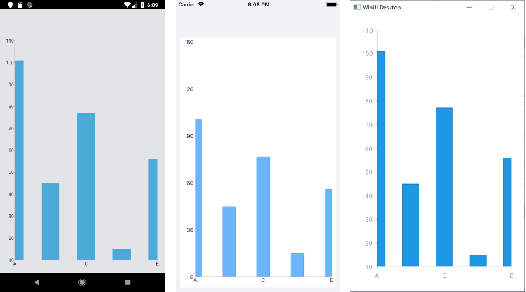

# .NET MAUI Chart Categorical Axis

When the Cartesian Chart visualizes Categorical Series, it needs an axis that can represents the different categories. Categories are built depending on the `CategoryBinding` value of each categorical data point in the owning Categorical Series. The axis is divided into discrete slots and each data point is visualized in the slot corresponding to its categorical value.

The `CategoricalAxis` inherits from the base `Axis` class. For more information, refer to the article on [inherited properties]().

## Features

The Categorical Axis exposes the following properties:

- `GapLength`&mdash;Defines the distance (in logical units [0,1]) between two adjacent categories. The default value is `0.3`. For example, if you have Bar Series, you can decrease the space between the bars from the different categories by setting the `GapLength` to a value lower than `0.3`.
- `MajorTickInterval`&mdash;Defines the step at which major ticks are generated. The default value is `1`. This property will also affect axis labels as they are generated based on a major tick basis.
- `PlotMode`&mdash;Defines the strategy used to position data points along the axis category slots. The possible values are `BetweenTicks` and `OnTicks`.
- `MajorTickBackgroundColor`&mdash;Specifies the major ticks color.
- `MajorTickThickness`&mdash;Specifies the thickness of the major ticks.

## Example

The following example shows how to format the axis labels on the Categorical Axis.

1. First, create the needed business objects:

 <snippet id='categorical-data-model' />


1. Then, create a `ViewModel`:

 <snippet id='chart-series-categorical-data-view-model' />


1. Finally, use the following snippet to declare the `RadChart` in XAML or in C#:

 ```XAML
    <telerik:RadCartesianChart>
	  <telerik:RadCartesianChart.BindingContext>
	    <local:CategoricalDataViewModel/>
	  </telerik:RadCartesianChart.BindingContext>
	  <telerik:RadCartesianChart.HorizontalAxis>
	    <telerik:CategoricalAxis PlotMode="OnTicks"
								      MajorTickInterval="2"
									  GapLength="0.5"/>
	  </telerik:RadCartesianChart.HorizontalAxis>
	  <telerik:RadCartesianChart.VerticalAxis>
	    <telerik:NumericalAxis LabelFitMode="MultiLine"/>
	  </telerik:RadCartesianChart.VerticalAxis>
	  <telerik:RadCartesianChart.Series>
	    <telerik:BarSeries ItemsSource="{Binding Data}"
		                        ValueBinding="Value"
                                CategoryBinding="Category"/>
	  </telerik:RadCartesianChart.Series>
    </telerik:RadCartesianChart>
 ```


The following image shows the end result.



## See Also

- [Axis Overview]()
- [Numerical Axis]()
- [DateTimeContinuous Axis]()
