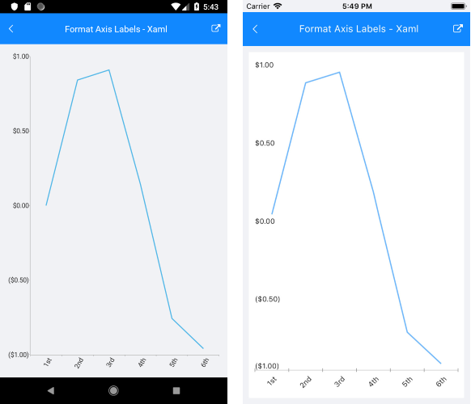

# .NET MAUI Chart DateTime Continuous Axis

Use `DateTimeContinuousAxis` when your chart data is organized by `DateTime` values and you want the horizontal or vertical axis to behave like a true timeline. Instead of treating each value as an isolated category, the axis builds time slots based on `Minimum`, `Maximum`, and `MajorStep`.

`DateTimeContinuousAxis` expects valid `DateTime` values so that the chart can position each data point correctly on the timeline. If you do not set the axis range properties explicitly, the chart calculates them automatically. The default major step is the smallest difference between any two `DateTime` values in the data source. Because the axis behaves like a numerical axis, it can display empty time slots when no data exists for a given interval.

`DateTimeContinuousAxis` inherits from `CartesianAxis`. For more information about shared axis members, see [Axis Overview]().

## When Should You Use DateTimeContinuousAxis

Use `DateTimeContinuousAxis` when you want to:

- Plot data points according to their actual `DateTime` value instead of their position in a category list.
- Show gaps in the timeline when data is missing for certain time intervals.
- Control the timeline range and interval units explicitly.

If you want each value to appear as a separate category regardless of the time difference between items, use a categorical axis instead.

## Features

Use the following properties to configure `DateTimeContinuousAxis`:

- `Minimum`&mdash;Defines the start value of the timeline. Set it to `DateTime.Minimum` to clear the value and let the axis determine the start automatically from the smallest available date.
- `Maximum`&mdash;Defines the end value of the timeline. Set it to `DateTime.Maximum` to clear the value and let the axis determine the end automatically from the greatest available date.
- `PlotMode`&mdash;Defines how data points are positioned relative to the time slots. The available values are `BetweenTicks` and `OnTicks`.
- `MajorStep`&mdash;Defines the interval between adjacent time slots. Set it to `double.PositiveInfinity` to clear the value and let the axis calculate it automatically from the smallest difference between any two dates.
- `MajorStepUnit`&mdash;Defines which `DateTime` component the `MajorStep` value refers to: `Year`, `Quarter`, `Month`, `Week`, `Day`, `Hour`, `Minute`, `Second`, or `Millisecond`.
- `GapLength`&mdash;Defines the distance in logical units `[0,1]` between adjacent time slots. The default value is `0.3`. For example, when clustered bar series should touch each other, set `GapLength` to `0`.

> The axis interval can be calculated automatically or fixed with `MajorStep` and `MajorStepUnit`.

## Example

The following example shows how to format the labels on a `DateTimeContinuousAxis`.

1. Create the business object class:

<snippet id='temporal-data-model' />

2. Create a `ViewModel` that exposes time-based data:

```csharp
public class ViewModel
{
    public ObservableCollection<TemporalData> Data { get; set; }

    public ViewModel()
    {
        this.Data = GetDateTimeData(6);
    }

    private static ObservableCollection<TemporalData> GetDateTimeData(int itemsCount)
    {
        var startDate = new DateTime(2015, 03, 01);

        ObservableCollection<TemporalData> items = new ObservableCollection<TemporalData>();
        for (int i = 0; i < itemsCount; i++)
        {
            TemporalData data = new TemporalData();
            data.Date = startDate.AddDays(i);
            data.Value = Math.Sin(i);

            items.Add(data);
        }

        return items;
    }
}
```

3. Create a `DateLabelFormatter` class that inherits from `LabelFormatterBase<DateTime>`:

```csharp
public class DateLabelFormatter : LabelFormatterBase<DateTime>
{
    public override string FormatTypedValue(DateTime value)
    {
        if (value.Day == 1)
        {
            return value.Day + "st";
        }
        else if (value.Day == 2)
        {
            return value.Day + "nd";
        }
        else if (value.Day == 3)
        {
            return value.Day + "rd";
        }
        else
        {
            return value.Day + "th";
        }
    }
}
```

4. Declare the `RadCartesianChart` in XAML and assign the axis formatter:

```xaml
<telerik:RadCartesianChart>
    <telerik:RadCartesianChart.BindingContext>
        <local:ViewModel />
    </telerik:RadCartesianChart.BindingContext>
    <telerik:RadCartesianChart.HorizontalAxis>
        <telerik:DateTimeContinuousAxis LabelFitMode="Rotate"
                                         MajorStepUnit="Day">
            <telerik:DateTimeContinuousAxis.LabelFormatter>
                <local:DateLabelFormatter />
            </telerik:DateTimeContinuousAxis.LabelFormatter>
        </telerik:DateTimeContinuousAxis>
    </telerik:RadCartesianChart.HorizontalAxis>
    <telerik:RadCartesianChart.VerticalAxis>
        <telerik:NumericalAxis LabelFormat="C"
                               MajorStep="0.5"
                               Minimum="-1"
                               Maximum="1" />
    </telerik:RadCartesianChart.VerticalAxis>
    <telerik:RadCartesianChart.Series>
        <telerik:LineSeries ItemsSource="{Binding Data}"
                            CategoryBinding="Date"
                            ValueBinding="Value" />
    </telerik:RadCartesianChart.Series>
</telerik:RadCartesianChart>
```

In this example, the axis uses `MajorStepUnit="Day"` and a custom label formatter so that each point is positioned on a daily timeline and each label shows a day suffix.

The following image shows the formatted `DateTimeContinuousAxis` labels:



## See Also

- [Categorical Axis]()
- [Numerical Axis]()
- [Axis Overview]()
