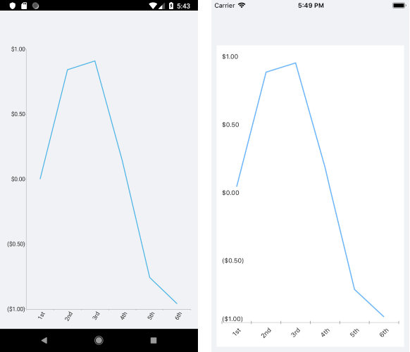

# .NET MAUI Chart DateTime Continuous Axis

The DateTime Continuous Axis is a special axis that extends the base `CartesianAxis` class and is a hybrid between a categorical and a numerical axis. `DateTimeContinuousAxis` works with categorical data but instead of categories, the axis builds time slots depending on its `Minimum`, `Maximum`, and `MajorStep` values.

The DateTime Continuous Axis also expects valid `DateTime` values so that the data can be plotted correctly. The `DateTimeContinuousAxis` is a timeline where each data point has a position depending on its `DateTime` value. The timeline range properties are automatically calculated if not set explicitly by the user: the default value of the major step is the smallest difference between any two `DateTime` values. As the axis behaves like a numerical axis, it can have empty slots if no data is available for these slots.

The `CategoricalAxis` inherits from the base `Axis` class. For more information, refer to the article on [inherited properties]().

## Features

The DateTime Continuous Axis exposes the following properties:

- `Minimum`&mdash;Defines the start value of the timeline. Specify `DateTime.Minimum` to clear the value and force the axis to determine it automatically, depending on the smallest present `DateTime` value.
- `Maximum`&mdash;Defines the end value of the timeline. Specify `DateTime.Maximum` to clear the value and force the axis to determine it automatically, depending on the greatest present `DateTime` value.
- `PlotMode`&mdash;Defines the strategy that is used to position data points along the axis time slots. The available options are `{ BetweenTicks, OnTicks }`.
- `MajorStep`&mdash;Defines the user-defined step between two adjacent time slots. Specify `double.PositiveInfinity` to clear the value and make the axis calculate an automatic step, depending on the smallest difference between any two dates.
- `MajorStepUnit`&mdash;Defines what `DateTime` component to which the `MajorStep` property refers (`{ Year, Quarter, Month, Week, Day, Hour, Minute, Second, Millisecond }`).
- `GapLength`&mdash;Defines the distance (in logical units [0,1]) between two adjacent time slots. The default value is `0.3`. As an example, if you have two Bar Series combined in the Cluster mode, you can remove the space between the bars by setting the `GapLength` property to `0`.

## Example

The following example shows how to format the axis labels on the DateTime Continuous Axis:

**1.** Create the needed business objects:

<snippet id='temporal-data-model' />

**2.** Create a `ViewModel`:

```C#
public class ViewModel
{
    public ObservableCollection<TemporalData> Data { get; set; }

    public ViewModel()
    {
        this.Data = GetDateTimeData(6);
    }

    private static ObservableCollection<TemporalData> GetDateTimeData(int itemsCount)
    {
        var startDate = new DateTime(2015, 03, 01);

        ObservableCollection<TemporalData> items = new ObservableCollection<TemporalData>();
        for (int i = 0; i < itemsCount; i++)
        {
            TemporalData data = new TemporalData();
            data.Date = startDate.AddDays(i);
            data.Value = Math.Sin(i);

            items.Add(data);
        }

        return items;
    }
}
```

**3.** Create a class, for example, `DateLabelFormatter` that inherits from `LabelFormatterBase<DateTime>` for the DateTime Continuous Axis.

```C#
public class DateLabelFormatter : LabelFormatterBase<DateTime>
{
    public override string FormatTypedValue(DateTime value)
    {
        if (value.Day == 1)
        {
            return value.Day + "st";
        }
        else if (value.Day == 2)
        {
            return value.Day + "nd";
        }
        else if (value.Day == 3)
        {
            return value.Day + "rd";
        }
        else
        {
            return value.Day + "th";
        }
    }
}
```

**4.** Use the following snippet to declare the `RadChart` in XAML :

 ```XAML
<telerik:RadCartesianChart>
	<telerik:RadCartesianChart.BindingContext>
	    <local:ViewModel />
	</telerik:RadCartesianChart.BindingContext>
	<telerik:RadCartesianChart.HorizontalAxis>
	    <telerik:DateTimeContinuousAxis LabelFitMode="Rotate"
	                                         MajorStepUnit="Day">
	        <telerik:DateTimeContinuousAxis.LabelFormatter>
	            <local:DateLabelFormatter />
	        </telerik:DateTimeContinuousAxis.LabelFormatter>
	    </telerik:DateTimeContinuousAxis>
	</telerik:RadCartesianChart.HorizontalAxis>
	<telerik:RadCartesianChart.VerticalAxis>
	    <telerik:NumericalAxis LabelFormat="C"
	                                MajorStep="0.5"
	                                Minimum="-1"
	                                Maximum="1" />
	</telerik:RadCartesianChart.VerticalAxis>
	<telerik:RadCartesianChart.Series>
	    <telerik:LineSeries ItemsSource="{Binding Data}"
                            CategoryBinding="Date"
                            ValueBinding="Value" />
	</telerik:RadCartesianChart.Series>
</telerik:RadCartesianChart>
 ```

The following image shows how the DateTime Continuous Axis `Formatter` looks:



## See Also

- [Categorical Axis]()
- [Numerical Axis]()
- [Axis Overview]()
