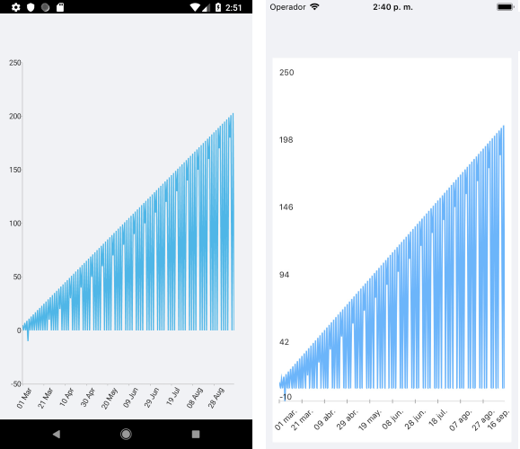

# ChartPanAndZoomBehavior

With **ChartPanAndZoomBehavior**, RadChart handles the gestures drag, pinch open and pinch close which respectively cause panning, zooming in and zooming out of the associated chart plot area.

## Features

- **ZoomMode**: Gets or sets value that specifies how the chart will respond to a zoom gesture. The available values are:
	- None
	- Horizontal
	- Vertical
	- Both
- **PanMode**: Gets or sets value that specifies how the chart will respond to a pan gesture. The available values are:
	- None
	- Horizontal
	- Vertical
	- Both
- **HandleDoubleTap**: Determines whether a double-tap gesture will be handled by the behavior to reset the values of the Zoom and ScrollOffset (Pan) properties of the chart.

## Example

Here is an example of how the Chart PanAndZoom Behavior works:

Create the needed business objects, for example:

```C#
public class TemporalData
{
    public DateTime Date { get; set; }

    public double Value { get; set; }
}
```

Create a ViewModel:

```C#
public class ViewModel
{
    public ObservableCollection<TemporalData> Data { get; set; }

    public ViewModel()
    {
        this.Data = new ObservableCollection<TemporalData>(GetDateTimeData(200));
    }

    private static List<TemporalData> GetDateTimeData(int itemsCount)
    {
        var startDate = new DateTime(2015, 03, 01);

        List<TemporalData> items = new List<TemporalData>();
        for (int i = 0; i < itemsCount; i++)
        {
            TemporalData data = new TemporalData();
            data.Date = startDate.AddDays(i);

            if (i % 2 == 0)
            {
                data.Value = i + 5;
            }
            else
            {
                if (i % 5 == 0)
                {
                    data.Value = i - 15;
                }
            }

            items.Add(data);
        }

        return items;
    }
}
```

Declare a RadCartesianChart in XAML:

```XAML
<telerikChart:RadCartesianChart PaletteName="Light"
                                Zoom="2, 1">
    <telerikChart:RadCartesianChart.BindingContext>
        <local:ViewModel/>
    </telerikChart:RadCartesianChart.BindingContext>
    <telerikChart:RadCartesianChart.HorizontalAxis>
        <telerikChart:DateTimeContinuousAxis LabelFitMode="Rotate"
                                             MajorStepUnit="Day"
                                             PlotMode="OnTicks"
                                             LabelFormat="dd MMM"
                                             MajorStep="20"
                                             ShowLabels="True"/>
    </telerikChart:RadCartesianChart.HorizontalAxis>
    <telerikChart:RadCartesianChart.VerticalAxis>
        <telerikChart:NumericalAxis />
    </telerikChart:RadCartesianChart.VerticalAxis>
    <telerikChart:RadCartesianChart.Series>
        <telerikChart:LineSeries ValueBinding="Value"
                                 CategoryBinding="Date"
                                 DisplayName="Sales"
                                 ItemsSource="{Binding Data}"/>
    </telerikChart:RadCartesianChart.Series>
    <telerikChart:RadCartesianChart.ChartBehaviors>
        <telerikChart:ChartPanAndZoomBehavior ZoomMode="Horizontal" 
                                              PanMode="Horizontal" 
                                              HandleDoubleTap="True"/>
    </telerikChart:RadCartesianChart.ChartBehaviors>
</telerikChart:RadCartesianChart>
```

Here is the result:



# See Also

- [Chart Selection Behavior]()
- [Chart Track Ball Behavior]()
- [Chart Tool Tip Behavior]()

	
