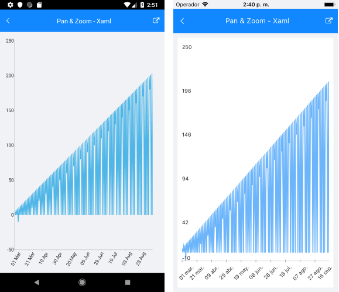

# Pan and Zoom Behavior

The Pan and Zoom behavior of the Chart handles the drag, pinch open, and pinch close gestures which respectively cause panning, zooming in, and zooming out of the associated chart plot area.

## Features

- `ZoomMode`&mdash;Gets or sets value that specifies how the chart will respond to a zoom gesture. The available values are:
	- `None`
	- `Horizontal`
	- `Vertical`
	- Both
- `PanMode`&mdash;Gets or sets the value that specifies how the chart will respond to a pan gesture. The available values are:
	- `None`
	- `Horizontal`
	- `Vertical`
	- Both
- `HandleDoubleTap`&mdash;Determines whether a double-tap gesture will be handled by the behavior to reset the values of the `Zoom` and `ScrollOffset` (`Pan`) properties of the chart.

## Example

The following example shows how the Pan and Zoom behavior of the Cart works:

1. Create the needed business objects, for example:

 <snippet id='temporal-data-model' />


1. Create a `ViewModel`:

 ```C#
public class ViewModel
{
    public ObservableCollection<TemporalData> Data { get; set; }

    public ViewModel()
    {
        this.Data = new ObservableCollection<TemporalData>(GetDateTimeData(200));
    }

    private static List<TemporalData> GetDateTimeData(int itemsCount)
    {
        var startDate = new DateTime(2015, 03, 01);

        List<TemporalData> items = new List<TemporalData>();
        for (int i = 0; i < itemsCount; i++)
        {
            TemporalData data = new TemporalData();
            data.Date = startDate.AddDays(i);

            if (i % 2 == 0)
            {
                data.Value = i + 5;
            }
            else
            {
                if (i % 5 == 0)
                {
                    data.Value = i - 15;
                }
            }

            items.Add(data);
        }

        return items;
    }
}
 ```

1. Declare a `RadCartesianChart` in XAML:

 ```XAML
<telerik:RadCartesianChart PaletteName="Light"
                                Zoom="2, 1">
    <telerik:RadCartesianChart.BindingContext>
        <local:ViewModel/>
    </telerik:RadCartesianChart.BindingContext>
    <telerik:RadCartesianChart.HorizontalAxis>
        <telerik:DateTimeContinuousAxis LabelFitMode="Rotate"
                                             MajorStepUnit="Day"
                                             PlotMode="OnTicks"
                                             LabelFormat="dd MMM"
                                             MajorStep="20"
                                             ShowLabels="True"/>
    </telerik:RadCartesianChart.HorizontalAxis>
    <telerik:RadCartesianChart.VerticalAxis>
        <telerik:NumericalAxis />
    </telerik:RadCartesianChart.VerticalAxis>
    <telerik:RadCartesianChart.Series>
        <telerik:LineSeries ValueBinding="Value"
                                 CategoryBinding="Date"
                                 DisplayName="Sales"
                                 ItemsSource="{Binding Data}"/>
    </telerik:RadCartesianChart.Series>
    <telerik:RadCartesianChart.ChartBehaviors>
        <telerik:ChartPanAndZoomBehavior ZoomMode="Horizontal"
                                              PanMode="Horizontal"
                                              HandleDoubleTap="True"/>
    </telerik:RadCartesianChart.ChartBehaviors>
</telerik:RadCartesianChart>
 ```


The following image shows the end result.



# See Also

- [Chart Selection Behavior]()
- [Chart Track Ball Behavior]()
- [Chart Tool Tip Behavior]()
