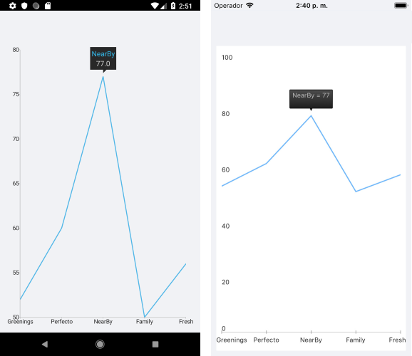

# .NET MAUI Chart ToolTip Behavior

The Tooltip behavior of the Chart handles rendering concise information about a data point in a small popup which is displayed close to its relevant data point.

## Features

The ToolTip behavior of the Chart supports the `TriggerMode` property that determines the gestures on which the `ChartToolTipBehavior` will show a tool tip. The available values are:
	- `Tap`
	- `Hold`

## Example

The following example shows how the ToolTip behavior of the Chart works:

1. Create the business object:

 <snippet id='temporal-data-model' />


1. Create a `ViewModel`:

 ```C#
public class ViewModel
{
    public ObservableCollection<TemporalData> Data { get; set; }

    public ViewModel()
    {
        this.Data = new ObservableCollection<TemporalData>(GetDateTimeData(200));
    }

    private static List<TemporalData> GetDateTimeData(int itemsCount)
    {
        var startDate = new DateTime(2015, 03, 01);

        List<TemporalData> items = new List<TemporalData>();
        for (int i = 0; i < itemsCount; i++)
        {
            TemporalData data = new TemporalData();
            data.Date = startDate.AddDays(i);

            if (i % 2 == 0)
            {
                data.Value = i + 5;
            }
            else
            {
                if (i % 5 == 0)
                {
                    data.Value = i - 15;
                }
            }

            items.Add(data);
        }

        return items;
    }
}
 ```

1. Declare a `RadCartesianChart` in XAML:

 ```XAML
<telerik:RadCartesianChart PaletteName="Light"
                                Zoom="2, 1">
    <telerik:RadCartesianChart.BindingContext>
        <local:ViewModel/>
    </telerik:RadCartesianChart.BindingContext>
    <telerik:RadCartesianChart.HorizontalAxis>
        <telerik:DateTimeContinuousAxis LabelFitMode="Rotate"
                                             MajorStepUnit="Day"
                                             PlotMode="OnTicks"
                                             LabelFormat="dd MMM"
                                             MajorStep="20"
                                             ShowLabels="True"/>
    </telerik:RadCartesianChart.HorizontalAxis>
    <telerik:RadCartesianChart.VerticalAxis>
        <telerik:NumericalAxis />
    </telerik:RadCartesianChart.VerticalAxis>
    <telerik:RadCartesianChart.Series>
        <telerik:LineSeries ValueBinding="Value"
                                 CategoryBinding="Date"
                                 DisplayName="Sales"
                                 ItemsSource="{Binding Data}"/>
    </telerik:RadCartesianChart.Series>
    <telerik:RadCartesianChart.ChartBehaviors>
        <telerik:ChartTooltipBehavior TriggerMode="Tap" />
     </telerik:RadCartesianChart.ChartBehaviors>
</telerik:RadCartesianChart>
 ```

The following image shows how the ToolTip looks:



# See Also

- [Chart Selection Behavior]()
- [Chart Track Ball Behavior]()
- [Chart Pan And Zoom Behavior]()
