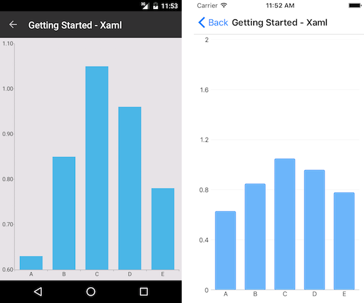

# Getting Started
   
## Define RadChart control

```XAML
<telerikChart:RadCartesianChart>     
	<telerikChart:RadCartesianChart.BindingContext>         
		<vm:ChartViewModel />     
	</telerikChart:RadCartesianChart.BindingContext>     
	<telerikChart:RadCartesianChart.HorizontalAxis>         
		<telerikChart:CategoricalAxis />     
	</telerikChart:RadCartesianChart.HorizontalAxis>     
	<telerikChart:RadCartesianChart.VerticalAxis>         
		<telerikChart:NumericalAxis />     
	</telerikChart:RadCartesianChart.VerticalAxis>     
	<telerikChart:RadCartesianChart.Series>         
		<telerikChart:BarSeries CategoryBinding="Category" 
								ValueBinding="Value" 
								ItemsSource="{Binding Data}" />     
	</telerikChart:RadCartesianChart.Series> 
</telerikChart:RadCartesianChart>
```

Add the following namespace:

```XAML
xmlns:telerikChart="clr-namespace:Telerik.XamarinForms.Chart;assembly=Telerik.Maui.Compatibility"
```

To visualize RadCartesianChart and RadPieChart -> Register the Telerik controls through `Telerik.Maui.Controls.Compatibility.UseTelerik` extension method called inside the `Configure` method of the **Startup.cs** file of your project:

```C#
using Telerik.Maui.Controls.Compatibility;

 

public void Configure(IAppHostBuilder appBuilder)
{
    appBuilder        
        .UseTelerik()
        .UseMauiApp<App>();
        
}              
```

## Populating RadChart with data

Here is how the business model is defined:

```C#
public class CategoricalData
{
    public object Category { get; set; }

    public double Value { get; set; }
}
```

and the ViewModel:

```C#
public class ChartViewModel
{
    public ChartViewModel()
    {
        this.Data = new ObservableCollection<CategoricalData>()
        {
            new CategoricalData { Category = "A", Value = 0.63 },
            new CategoricalData { Category = "B", Value = 0.85 },
            new CategoricalData { Category = "C", Value = 1.05 },
            new CategoricalData { Category = "D", Value = 0.96 },
            new CategoricalData { Category = "E", Value = 0.78 },
        };
    }
	
    public ObservableCollection<CategoricalData> Data { get; set; }
}
```

Here is the result:



## See Also

- [Cartesian Chart]()
- [Pie Chart]()
- [Chart Legend]()