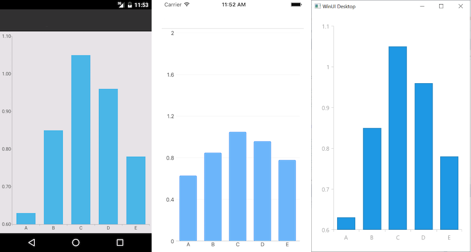

# Getting Started
   
## Create the control definition in XAML

```XAML
<telerikChart:RadCartesianChart>     
	<telerikChart:RadCartesianChart.BindingContext>         
		<vm:ChartViewModel />     
	</telerikChart:RadCartesianChart.BindingContext>     
	<telerikChart:RadCartesianChart.HorizontalAxis>         
		<telerikChart:CategoricalAxis />     
	</telerikChart:RadCartesianChart.HorizontalAxis>     
	<telerikChart:RadCartesianChart.VerticalAxis>         
		<telerikChart:NumericalAxis />     
	</telerikChart:RadCartesianChart.VerticalAxis>     
	<telerikChart:RadCartesianChart.Series>         
		<telerikChart:BarSeries CategoryBinding="Category" 
								ValueBinding="Value" 
								ItemsSource="{Binding Data}" />     
	</telerikChart:RadCartesianChart.Series> 
</telerikChart:RadCartesianChart>
```
In addition to this, you need to add the following namespace:

```XAML
xmlns:telerikChart="clr-namespace:Telerik.XamarinForms.Chart;assembly=Telerik.Maui.Compatibility"
```

To visualize RadCartesianChart and RadPieChart -> Register renderers inside the `ConfigureMauiHandlers` method of the **Startup.cs** file of your project. 

```C#
.ConfigureMauiHandlers(handlers => {
			
	// renderer for Telerik UI for MAUI RadCartesianChart control
	handlers.AddCompatibilityRenderer(typeof(Telerik.XamarinForms.Chart.RadCartesianChart), typeof(ChartRenderer.CartesianChartRenderer));
	
	// renderer for Telerik UI for MAUI RadCPieChart control
	handlers.AddCompatibilityRenderer(typeof(Telerik.XamarinForms.Chart.RadPieChart), typeof(ChartRenderer.PieChartRenderer));		
```

## 4. Populating RadChart with data ##

Here is how the business model is defined:

```C#
public class CategoricalData
{
    public object Category { get; set; }

    public double Value { get; set; }
}
```

and the ViewModel:

```C#
public class ChartViewModel
{
    public ChartViewModel()
    {
        this.Data = new ObservableCollection<CategoricalData>()
        {
            new CategoricalData { Category = "A", Value = 5 },
            new CategoricalData { Category = "B", Value = 15 },
            new CategoricalData { Category = "C", Value = 3 },
            new CategoricalData { Category = "D", Value = 10 },
            new CategoricalData { Category = "E", Value = 2 },
            new CategoricalData { Category = "F", Value = 9 },
        };
    }
	
    public ObservableCollection<CategoricalData> Data { get; set; }
}
```

Here is the result:



## See Also

- [Cartesian Chart]()
- [Pie Chart]()
- [Chart Legend]()