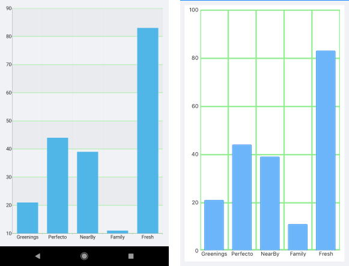

# CartesianChartGrid

## Overview

The CartesianChartGrid represents a decoration over the plot area of RadCartesianChart. It adds major lines connected to each Major tick of each axis. You can set a new grid through the RadCartesianChart.Grid property.

## Features

- **MajorLinesVisibility** : Gets or sets the visibility of major grid lines. In other means : a line that extends the major ticks throughout the plot area.
- **MajorLineThickness**: Gets or sets the thickness of the Major Grid Lines.
- **MajorLineColor**: Gets or sets the color the of Major Grid Lines.
- **MajorXLineDashArray** : Gets or sets a collection of Double values that indicates the pattern of dashes and gaps that is used to outline Major X Grid Line.
- **MajorYLineDashArray**: Gets or sets a collection of Double values that indicates the pattern of dashes and gaps that is used to outline Major Y Grid Line.
- **StripeLinesVisibility**:  Gets or sets the visibility of the grid stripes. In other means : the area between two grid lines.
- **YStripeColor** : Gets or sets the color of the area between two major ticks of the Vertical Axis. This color alternates with the YStripeAlternativeColor starting from the first area.
- **YStripeAlternativeColor** : Gets or sets the color of the area between two major ticks of the Vertical Axis. This color alternates with the YStripeColor starting from the second area.
- **XStripeColor**: Gets or sets the color of the area between two major ticks of the Horizontal Axis. This color alternates with the XStripeAlternativeColor starting from the first area.
- **XStripeAlternativeColor**: Gets or sets the color of the area between two major ticks of the Horizontal Axis. This color alternates with the XStripeAlternativeColor starting from the second area.

## Example

Here is an example how the CartesianChartGrid works:

First, create the needed business objects:

```C#
public class CategoricalData
{
    public object Category { get; set; }

    public double Value { get; set; }
}
```

Then create a ViewModel:

```C#
public class ViewModel
{
    public ObservableCollection<CategoricalData> Data { get; set; }

    public ViewModel()
    {
        this.Data = GetCategoricalData();
    }

    private static ObservableCollection<CategoricalData> GetCategoricalData()
    {
        var data = new ObservableCollection<CategoricalData>
        {
            new CategoricalData { Category = "Greenings", Value = 21 },
            new CategoricalData { Category = "Perfecto", Value = 44 },
            new CategoricalData { Category = "NearBy", Value = 39 },
            new CategoricalData { Category = "Family", Value = 11 },
            new CategoricalData { Category = "Fresh", Value = 83 },
        };
        return data;
    }
}
```

Finally, use the following snippet to declare the RadChart in XAML:

```XAML
<telerikChart:RadCartesianChart>
    <telerikChart:RadCartesianChart.BindingContext>
        <local:ViewModel />
    </telerikChart:RadCartesianChart.BindingContext>
    <telerikChart:RadCartesianChart.VerticalAxis>
        <telerikChart:NumericalAxis />
    </telerikChart:RadCartesianChart.VerticalAxis>
    <telerikChart:RadCartesianChart.HorizontalAxis>
        <telerikChart:CategoricalAxis LabelFitMode="MultiLine" />
    </telerikChart:RadCartesianChart.HorizontalAxis>
    <telerikChart:RadCartesianChart.Series>
        <telerikChart:BarSeries ValueBinding="Value"
                                CategoryBinding="Category"
                                ItemsSource="{Binding Data}" />
    </telerikChart:RadCartesianChart.Series>
    <telerikChart:RadCartesianChart.Grid>
        <telerikChart:CartesianChartGrid StripLinesVisibility="Y"
                                         MajorLinesVisibility="XY"
                                         MajorLineColor="LightGreen"
                                         MajorLineThickness="3" />
    </telerikChart:RadCartesianChart.Grid>
</telerikChart:RadCartesianChart>
```

Add the following namespace:

```XAML
xmlns:telerikChart="clr-namespace:Telerik.XamarinForms.Chart;assembly=Telerik.Maui.Compatibility"
```

Here is how the CartesianGridLineAnnotation looks:



## See Also

- [Chart Annotations]()
- [Chart Legend]()
- [Chart Null Values]()
