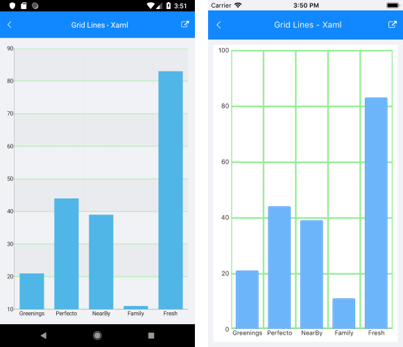

# Cartesian Chart Grid

The Cartesian Chart Grid represents a decoration over the plot area of `RadCartesianChart`. It adds major lines connected to each `Major` tick of each axis. You can set a new grid through the `RadCartesianChart.Grid` property.

## Features

The Cartesian Chart Grid provides the following features:

- `MajorLinesVisibility`&mdash;Gets or sets the visibility of major grid lines; in other words, a line that extends the major ticks throughout the plot area.
- `MajorLineThickness`&mdash;Gets or sets the thickness of the major grid lines.
- `MajorLineColor`&mdash;Gets or sets the color the of major grid lines.
- `MajorXLineDashArray`&mdash;Gets or sets a collection of double values that indicates the pattern of dashes and gaps that is used to outline the X major grid line.
- `MajorYLineDashArray`&mdash;Gets or sets a collection of double values that indicates the pattern of dashes and gaps that is used to outline Y major grid line.
- `StripeLinesVisibility`&mdash;Gets or sets the visibility of the grid stripes; in other words, the area between two grid lines.
- `YStripeColor`&mdash;Gets or sets the color of the area between two major ticks of the Vertical Axis. This color alternates with the `YStripeAlternativeColor` starting from the first area.
- `YStripeAlternativeColor`&mdash;Gets or sets the color of the area between two major ticks of the Vertical Axis. This color alternates with the `YStripeColor` starting from the second area.
- `XStripeColor`&mdash;Gets or sets the color of the area between two major ticks of the Horizontal Axis. This color alternates with the `XStripeAlternativeColor` starting from the first area.
- `XStripeAlternativeColor`&mdash;Gets or sets the color of the area between two major ticks of the Horizontal Axis. This color alternates with the `XStripeAlternativeColor` starting from the second area.

## Example

The following example shows how the Cartesian Chart Grid works:

1. First, create the needed business objects:

 <snippet id='categorical-data-model' />


1. Then, create a `ViewModel`:

 ```C#
public class ViewModel
{
    public ObservableCollection<CategoricalData> Data { get; set; }

    public ViewModel()
    {
        this.Data = GetCategoricalData();
    }

    private static ObservableCollection<CategoricalData> GetCategoricalData()
    {
        var data = new ObservableCollection<CategoricalData>
        {
            new CategoricalData { Category = "Greenings", Value = 21 },
            new CategoricalData { Category = "Perfecto", Value = 44 },
            new CategoricalData { Category = "NearBy", Value = 39 },
            new CategoricalData { Category = "Family", Value = 11 },
            new CategoricalData { Category = "Fresh", Value = 83 },
        };
        return data;
    }
}
 ```

1. Finally, declare the `RadChart` in XAML:

 ```XAML
<telerik:RadCartesianChart>
    <telerik:RadCartesianChart.BindingContext>
        <local:ViewModel />
    </telerik:RadCartesianChart.BindingContext>
    <telerik:RadCartesianChart.VerticalAxis>
        <telerik:NumericalAxis />
    </telerik:RadCartesianChart.VerticalAxis>
    <telerik:RadCartesianChart.HorizontalAxis>
        <telerik:CategoricalAxis LabelFitMode="MultiLine" />
    </telerik:RadCartesianChart.HorizontalAxis>
    <telerik:RadCartesianChart.Series>
        <telerik:BarSeries ValueBinding="Value"
                                CategoryBinding="Category"
                                ItemsSource="{Binding Data}" />
    </telerik:RadCartesianChart.Series>
    <telerik:RadCartesianChart.Grid>
        <telerik:CartesianChartGrid StripLinesVisibility="Y"
                                         MajorLinesVisibility="XY"
                                         MajorLineColor="LightGreen"
                                         MajorLineThickness="3" />
    </telerik:RadCartesianChart.Grid>
</telerik:RadCartesianChart>
 ```

1. Add the following namespace:

 ```XAML
xmlns:telerik="http://schemas.telerik.com/2022/xaml/maui"
 ```

The following image shows how the `CartesianGridLineAnnotation` looks:



## See Also

- [Chart Annotations]()
- [Chart Legend]()
- [Chart Null Values]()
