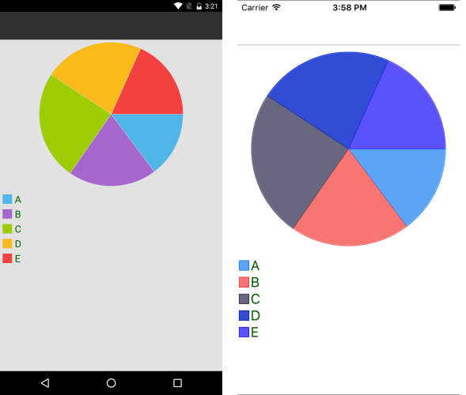
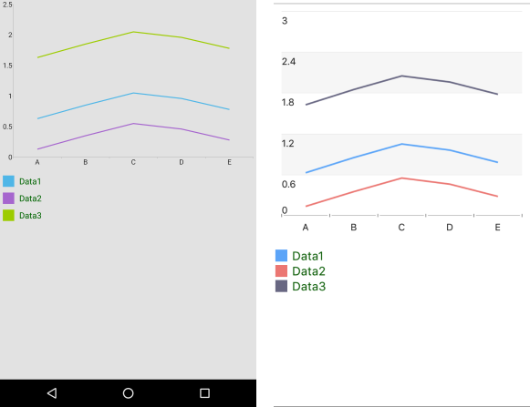

# Chart Legend

The Legend feature of the `RadChart` makes it easy for you to provide description regarding the series which are visualized within the control.

To add the legend feature in your application, you need to initialize a new object of type `RadLegend`.

<snippet id='chart-features-piechart-legend-definition-xaml'/>

The following image shows the `RadLegend` in combination with the Pie Chart.

## Properties

As shown in the previous image, each item within the `RadLegend` represents a specific series. The most important property which you need to set is the `LegendProvider`. It will point to the chart object whose series will be included in the legend.

The following list summarizes the most important properties of the `RadLegend` control. In brackets is commented the type of the property:

* `LegendProvider` (`RadChartBase`)&mdash;The Chart control whose series will be described in the legend.
* `LegendItemFontSize` (`double`)&mdash;The size of the item's title text.
* `LegendItemFontColor` (`Color`)&mdash;The color of the item's title text.
* `LegendItemIconSize` (`Size`)&mdash;The size of the title icons.
* `Orientation` (`LegndOrientation`)&mdash;Sets the orientation of the legend. Can be `Horizontal` or `Vertical`.

`RadLegend` can be used in combination with `RadCartesianChart` as well.

The following example demonstrates how to define some of the most important Chart legend properties.

<snippet id='chart-features-cartesianchart-legend-definition-xaml'/>

The following image shows the `RadLegend` control in combination with a Cartesian Chart.

## Legend Title Binding

The `LegendTitleBinding` is a property which can be set specifically for the Pie Series. It points to the property of the data item which will be used as a title in the legend. For all other series, the `DisplayName` property will be used instead.

<snippet id='chart-features-piechart-legendtitlebinding-xaml'/>

## See Also

- [CartesianChartGrid]()
- [Annotations]()
