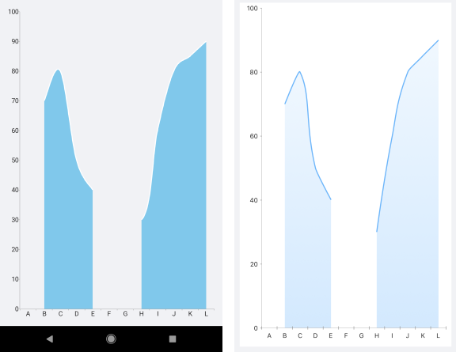

# Null Values Support in .NET MAUI Chart

In many scenarios some of the data points that are visualized in the Chart contain empty or null values. These are the cases when data is not available for some records from the used dataset.

In case of Cartesian Series that require X and Y axes (Line, Area, Bar, and so on), the Chart represents `null` data points with an empty space or gap. In case of other chart types (Pie or Donut), these data points are not visualized.

The following example demonstrates a data-bound scenario where a nullable `double` type is used.

**1.** Create a `ViewModel` with a collection of `CategoryItems` objects, where a few of the items have null values:

<snippet id='chart-nullvalues-viewmodel'/>


**2.** Add a `RadCartesianChart` with a Spline Area Series, for example:

<snippet id='chart-nullvalues-xaml'/>

**3.** Add the `telerik` namespace:

```XAML
xmlns:telerik="http://schemas.telerik.com/2022/xaml/maui" 
```

The image below shows how the null data points are visualized as gaps.



## See Also

- [Series Overview]()
