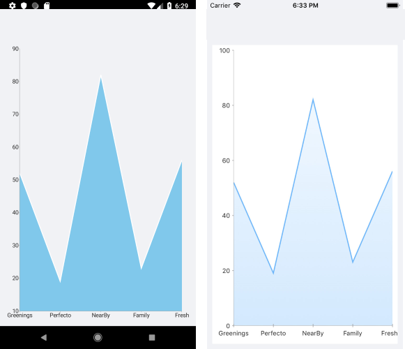
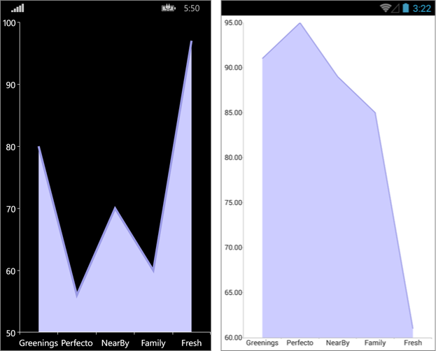

# Area Series

The Cartesian Chart visualizes the Area Series as an area on the chart that is enclosed by the coordinate axes and straight line segments that connect the data points represented by these series. The Area Series extend the Categorical Stroked Series, so they are also Categorical Series and require one Categorical Axis and one Numerical Axis.

## Features

The Area Series supports the following properties:

- `Fill`&mdash;Defines the fill of the Area Series.
- `Stroke`&mdash;Changes the color for drawing lines.
- `StrokeThickness`&mdash;Changes the width of the lines.

## Area Series Example

The following example shows how to create a Cartesian Chart with an Area Series:

1. Create the a sample business object:

 <snippet id='categorical-data-model' />


1. Create a `ViewModel`:

 <snippet id='chart-series-categorical-view-model' />


1. Use the following snippet to declare a Cartesian Chart with an Area Series in XAML and in C#:

 <snippet id='chart-series-area-xaml' />


The following image shows the end result:



## Customization Example

You can further customize the Area Series:

```C#
	var series = new AreaSeries
	{
		Fill = new Color(0.8, 0.8, 1),
		Stroke = new Color(0.6, 0.6, 0.9),
		StrokeThickness = 5
	};
```


The following image shows the final result:



## See Also

- [Bar Series]()
- [Line Series]()
- [Spline Series]()
