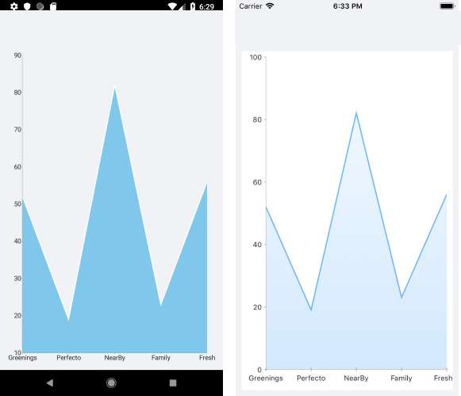
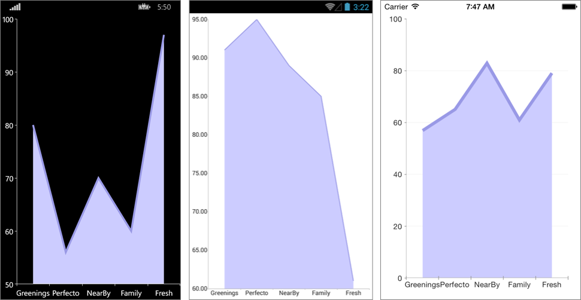

# .NET MAUI Chart Area Series

Use `AreaSeries` to plot categorical data as a continuous line with a filled area between the line and the chart axis. This series is useful when you want to emphasize both the trend and the magnitude of the values across categories.

`AreaSeries` derives from the categorical stroked series types, so it requires one categorical axis and one numerical axis in a `RadCartesianChart`. The series fill is defined by the chart axes, which matters when you want the shaded area to appear above instead of below the line.

## When to Use the Area Series

Use `AreaSeries` when you want to:

- Show how values change across categories.
- Emphasize the distance between the data points and the chart baseline.
- Combine a trend line with a filled visual that is easier to compare at a glance.

## Features

The `AreaSeries` exposes the following properties:

- `Fill`&mdash;Defines the fill of the area.
- `Stroke`&mdash;Defines the color of the series line.
- `StrokeThickness`&mdash;Defines the width of the series line.

## Area Series Example

The following example shows how to create a `RadCartesianChart` with an `AreaSeries`:

1. Create a sample business object:

<snippet id='categorical-data-model' />

2. Create a `ViewModel`:

<snippet id='chart-series-categorical-view-model' />

3. Declare a `RadCartesianChart` with an `AreaSeries` in XAML or C#:

<snippet id='chart-series-area-xaml' />

The following image shows the result:



## Customization Example

You can further customize the Area Series:

```C#
var series = new AreaSeries
{
	Fill = new Color(0.8, 0.8, 1),
	Stroke = new Color(0.6, 0.6, 0.9),
	StrokeThickness = 5
};
```

The following image shows a customized area series with a thicker line and a light fill:



## See Also

- [Chart Axes Overview]()
- [Categorical Axis]()
- [Bar Series]()
- [Line Series]()
- [Spline Series]()
