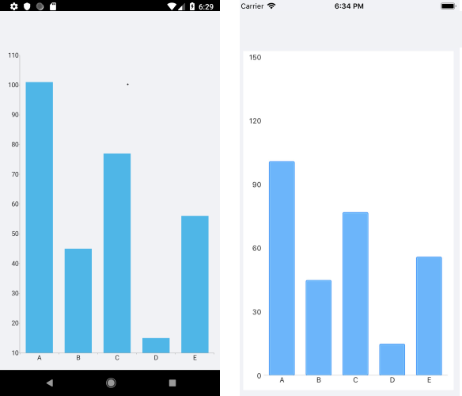

# Bar Series

The Cartesian Chart visualizes each data point from the Bar Series as a rectangle (or a bar). These rectangles can be displayed either horizontally, or vertically, depending on whether the Categorical Axis is the vertical axis or the horizontal one. When the horizontal axis is categorical, the rectangles are displayed vertically. This means that they display an equal width while their height represents the numerical value of each of the data points. On the other hand, when the vertical axis is categorical, the rectangles have equal height, while their width represents the value of the data point.

The Bar Series inherits from the Categorical Series and requires one Categorical Axis and one Numerical Axis.

>tip For more information about the common Categorical Series features that are also applicable to the Bar Series, refer to the [article on series features]().

## Example

The following example shows how to create a Cartesian Chart with Bar Series:

1. Create the needed business objects, for example:

 <snippet id='categorical-data-model' />

1. Create a `ViewModel`:

 <snippet id='chart-series-categorical-data-view-model' />

1. Use the following snippet to declare a Cartesian Chart with a Bar Series in XAML:

 <snippet id='chart-series-barvertical-xaml' />

The following image shows how the Bar Series looks:

## See Also

- [Categorical Series Overview]()
- [Categorical Series Orientation]()
- [Cartegorical Series Combine Mode]()
