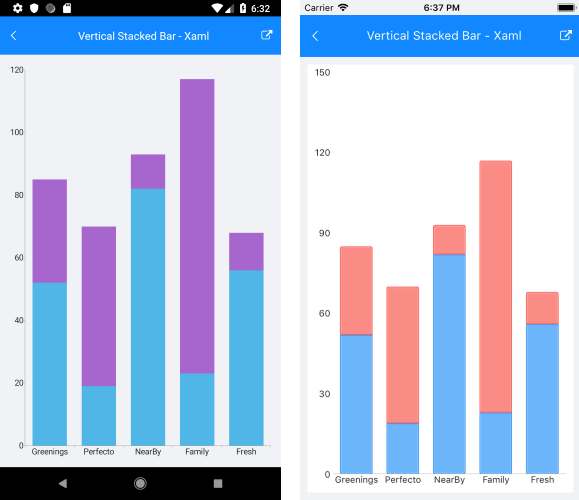
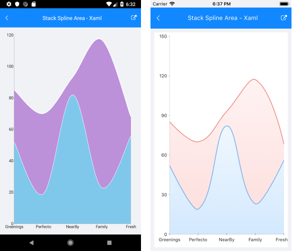

# .NET MAUI Chart Categorical Series Combine Mode

When the series in a Cartesian Chart are more than one, a few different drawing strategies can be used.

The possible strategies are:

- `None`&mdash;The series are not combined and each series is plotted independently.
- `Cluster`&mdash;The series are combined next to each other (applicable for Bar Series).
- `Stack`&mdash;The series form stacks.
- `Stack100`&mdash;The series form stacks that occupy 100% of the plot area and the characteristic size of each series is proportional to its relative value.

The default combine mode is `None`. You can define the current combine mode with the `CombineMode` property of the series.

>note The `CombineMode` can be applied only to Categorical Series such as Bar, Line, and Area.

## Stack Bar Series Example

The following example shows how to create a Stack Cartesian Chart with Bar Series :

1. Create the needed business objects, for example:

 <snippet id='categorical-data-model' />

1. Create a `ViewModel`:

 <snippet id='chart-series-series-categorical-view-model' />

1. Declare a `CombineMode` property to the Bar Series in XAML:

 <snippet id='chart-series-stackbarvertical-xaml' />

The following image shows how a Stack Bar Series looks:

## Stack Area Series Example

`CombineMode="Stack"` for `AreaSeries`

 <snippet id='chart-series-stackarea-xaml' />

The following image shows how a Stack Area Series looks:

## Stack Spline Area Series Example

`CombineMode="Stack"` for `SplineAreaSeries`

 <snippet id='chart-series-stacksplinearea-xaml' />

The following image shows how a Stack Spline Area Series looks:

## See Also

- [CartesianChart Orientation]()
