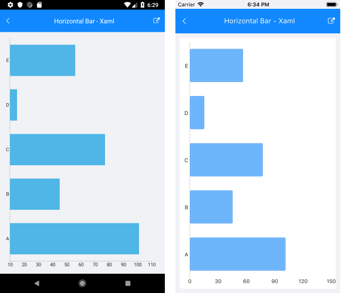
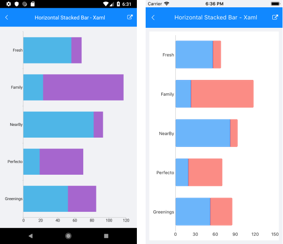

# Categorical Series Orientation

The orientation of the series depends on which chart axis is horizontal and which one is vertical.

>note The `Orientation` property can be applied only to Categorical Series, such as Bar, Line, and Area.

## Horizontal Bar Series Example

The following example shows how to create a Cartesian Chart with a vertical `CategoricalAxis` and a Horizontal Bar Series:

1. First, create the needed business objects, for example:

 <snippet id='categorical-data-model' />

1. Then, create a `ViewModel`:

 <snippet id='chart-series-categorical-data-view-model' />

1. Finally, use the following snippet to declare a `RadCartesianChart` with a Bar Series in XAML:

 <snippet id='chart-series-barhorizontal-xaml' />

The following image shows the end result.

## Horizontal Stack Bar Series Example

The following example shows how to create a Cartesian Chart with a vertical `CategoricalAxis` and a Stack Horizontal Bar Series:

1. First, create the needed business objects, for example:

 <snippet id='categorical-data-model' />

1. Then create a `ViewModel`:

 <snippet id='chart-series-series-categorical-view-model' />

1. Finally, use the following snippet to declare a Cartesian Chart with a Bar Series in XAML:

 <snippet id='chart-series-stackbarhorizontal-xaml' />

The following image shows the end result:

## See Also

- [CartesianChart Combine Mode]()
