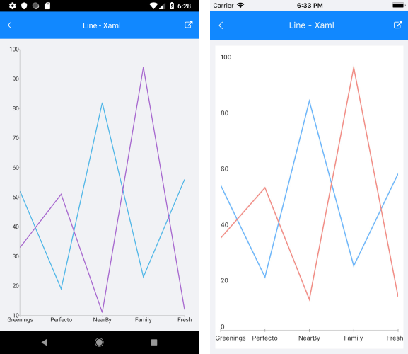
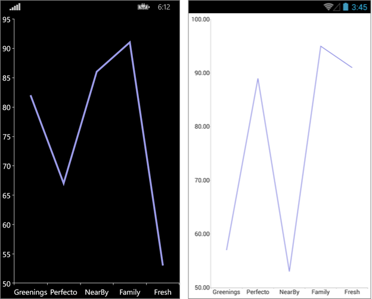

# Line Series

## Overview

**RadCartesianChart** visualizes each data item from the **LineSeries** and connects them with straight line segments. The **LineSeries** extend **CategoricalStrokedSeries**, so they are also **CategoricalSeries** and require one **CategoricalAxis** and one **NumricalAxis**.

## Features

- **Stroke** (Color): changes the color used to draw lines.
- **StrokeThickness** (double): changes the width of the lines.

## Example

Here is an example how to create RadCartesianChartChart with Line Series:

First, create the needed business objects, for example:

```C#
public class CategoricalData
{
    public object Category { get; set; }

    public double Value { get; set; }
}
```

Then create a ViewModel:

```C#
public class SeriesCategoricalViewModel
{
    public ObservableCollection<CategoricalData> Data1 { get; set; }
    public ObservableCollection<CategoricalData> Data2 { get; set; }

    public SeriesCategoricalViewModel()
    {
        this.Data1 = GetCategoricalData1();
        this.Data2 = GetCategoricalData2();
    }

    private static ObservableCollection<CategoricalData> GetCategoricalData1()
    {
        var data = new ObservableCollection<CategoricalData>
        {
            new CategoricalData { Category = "Greenings", Value = 52 },
            new CategoricalData { Category = "Perfecto", Value = 19 },
            new CategoricalData { Category = "NearBy", Value = 82 },
            new CategoricalData { Category = "Family", Value = 23 },
            new CategoricalData { Category = "Fresh", Value = 56 },
        };
        return data;
    }

    private static ObservableCollection<CategoricalData> GetCategoricalData2()
    {
        var data = new ObservableCollection<CategoricalData>
        {
            new CategoricalData { Category = "Greenings", Value = 33 },
            new CategoricalData { Category = "Perfecto", Value = 51 },
            new CategoricalData { Category = "NearBy", Value = 11 },
            new CategoricalData { Category = "Family", Value = 94 },
            new CategoricalData { Category = "Fresh", Value = 12 },
        };
        return data;
    }
}
```

Finally, use the following snippet to declare a RadCartesianChart with Line Series in XAML:

```XAML
<telerikChart:RadCartesianChart>
    <telerikChart:RadCartesianChart.BindingContext>
        <local:SeriesCategoricalViewModel />
    </telerikChart:RadCartesianChart.BindingContext>
    <telerikChart:RadCartesianChart.HorizontalAxis>
        <telerikChart:CategoricalAxis LabelFitMode="MultiLine"
                                      PlotMode="OnTicks" />
    </telerikChart:RadCartesianChart.HorizontalAxis>
    <telerikChart:RadCartesianChart.VerticalAxis>
        <telerikChart:NumericalAxis />
    </telerikChart:RadCartesianChart.VerticalAxis>
    <telerikChart:RadCartesianChart.Series>
        <telerikChart:LineSeries ValueBinding="Value"
                                 CategoryBinding="Category"
                                 ItemsSource="{Binding Data1}" />
        <telerikChart:LineSeries ValueBinding="Value"
                                 CategoryBinding="Category"
                                 ItemsSource="{Binding Data2}" />
    </telerikChart:RadCartesianChart.Series>
</telerikChart:RadCartesianChart>
```

And here is the result:



### Customization Example
Here we make some customizations:
```C#
	var series = new LineSeries 
	{ 
		Stroke = new Color(0.6, 0.6, 0.9),
		StrokeThickness = 5 
	};
```


## See Also

- [ScatterArea Series]()
- [ScatterLine Series]()
- [ScatterPoint Series]()