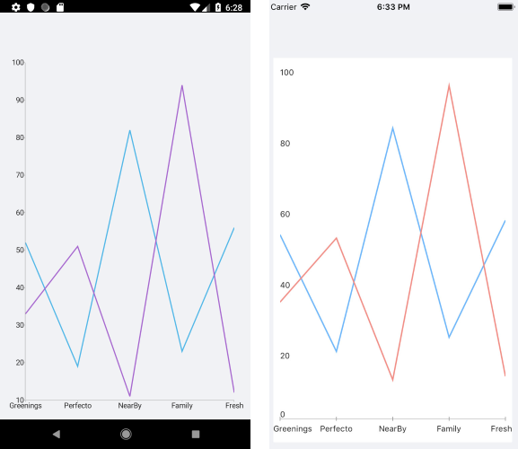

# Line Series

The Cartesian Chart visualizes each data item from the Line Series and connects them with straight line segments. The Line Series extend the Categorical Stroked Series, so they are also Categorical Series and require one Categorical Axis and one Numerical Axis.

## Features

The Line Series supports the following properties:

- `Stroke` (Color)&mdash;Changes the color for drawing lines.
- `StrokeThickness` (double)&mdash;Changes the width of the lines.

## Line Series Example

The following example shows how to create a `RadCartesianChartChart` with a Line Series:

1. First, create the needed business objects, for example:

 ```C#
public class CategoricalData
{
    public object Category { get; set; }

    public double Value { get; set; }
}
 ```

1. Then, create a `ViewModel`:

 ```C#
public class SeriesCategoricalViewModel
{
    public ObservableCollection<CategoricalData> Data1 { get; set; }
    public ObservableCollection<CategoricalData> Data2 { get; set; }

    public SeriesCategoricalViewModel()
    {
        this.Data1 = GetCategoricalData1();
        this.Data2 = GetCategoricalData2();
    }

    private static ObservableCollection<CategoricalData> GetCategoricalData1()
    {
        var data = new ObservableCollection<CategoricalData>
        {
            new CategoricalData { Category = "Greenings", Value = 52 },
            new CategoricalData { Category = "Perfecto", Value = 19 },
            new CategoricalData { Category = "NearBy", Value = 82 },
            new CategoricalData { Category = "Family", Value = 23 },
            new CategoricalData { Category = "Fresh", Value = 56 },
        };
        return data;
    }

    private static ObservableCollection<CategoricalData> GetCategoricalData2()
    {
        var data = new ObservableCollection<CategoricalData>
        {
            new CategoricalData { Category = "Greenings", Value = 33 },
            new CategoricalData { Category = "Perfecto", Value = 51 },
            new CategoricalData { Category = "NearBy", Value = 11 },
            new CategoricalData { Category = "Family", Value = 94 },
            new CategoricalData { Category = "Fresh", Value = 12 },
        };
        return data;
    }
}
 ```

1. Finally, use the following snippet to declare a `RadCartesianChart` with a Line Series in XAML:

 ```XAML
<telerikChart:RadCartesianChart>
    <telerikChart:RadCartesianChart.BindingContext>
        <local:SeriesCategoricalViewModel />
    </telerikChart:RadCartesianChart.BindingContext>
    <telerikChart:RadCartesianChart.HorizontalAxis>
        <telerikChart:CategoricalAxis LabelFitMode="MultiLine"
                                      PlotMode="OnTicks" />
    </telerikChart:RadCartesianChart.HorizontalAxis>
    <telerikChart:RadCartesianChart.VerticalAxis>
        <telerikChart:NumericalAxis />
    </telerikChart:RadCartesianChart.VerticalAxis>
    <telerikChart:RadCartesianChart.Series>
        <telerikChart:LineSeries ValueBinding="Value"
                                 CategoryBinding="Category"
                                 ItemsSource="{Binding Data1}" />
        <telerikChart:LineSeries ValueBinding="Value"
                                 CategoryBinding="Category"
                                 ItemsSource="{Binding Data2}" />
    </telerikChart:RadCartesianChart.Series>
</telerikChart:RadCartesianChart>
 ```

The following image shows the end result:



## Customization Example

You can further customize the Line Series:

```C#
	var series = new LineSeries
	{
		Stroke = new Color(0.6, 0.6, 0.9),
		StrokeThickness = 5
	};
```


## See Also

- [ScatterArea Series]()
- [ScatterLine Series]()
- [ScatterPoint Series]()
