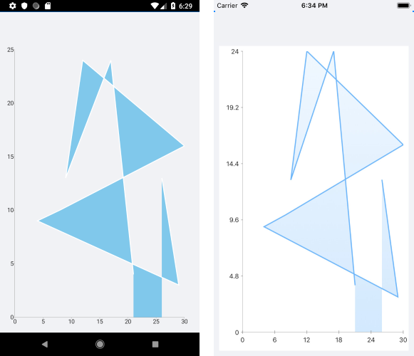

# .NET MAUI Chart ScatterArea Series

The Cartesian Chart visualizes the ScatterArea Series as the area enclosed by the coordinate axes and straight line segments that connect the series data points. The ScatterArea Series inherit from the `[ScatterPointSeries]()` class and also require both Chart axes to be Numerical Axes.

## Features

The ScatterArea Series provides the following properties to change its style:

- `Stroke` (Color)&mdash;Changes the color for drawing lines.
- `StrokeThickness` (double)&mdash;Changes the width of the lines.
- `Fill` (Color)&mdash;Changes the color of the chart area.

## ScatterArea Series Example

The following example shows how to create a `RadCartesianChart` with a ScatterArea Series:

1. Create the needed business objects, for example:

 <snippet id='numerical-data-model' />


1. Create a `ViewModel`:

 <snippet id='chart-series-numerical-view-model' />


1. Use the following snippet to declare a Cartesian Chart with a ScatterArea Series in XAML:

 <snippet id='chart-series-scatterarea-xaml' />


The following image shows the end result:



## Customization Example

You can further customize the ScatterArea Series:

```C#
	var series = new ScatterAreaSeries
	{
		Stroke = new Color(0.6, 0.6, 0.9),
		StrokeThickness = 5,
		Fill = new Color(0.8, 0.8, 1)
	};
```

## See Also

- [Line Series]()
- [ScatterLine Series]()
- [ScatterPoint Series]()
