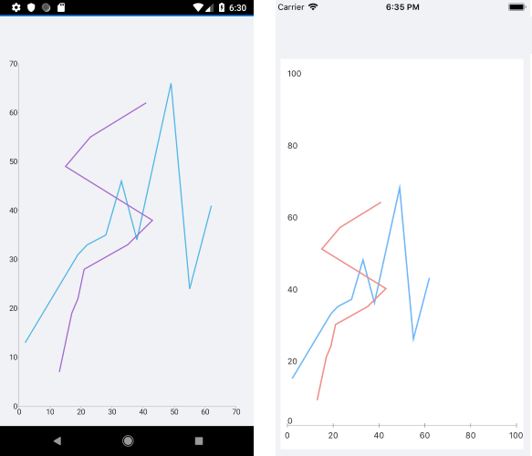
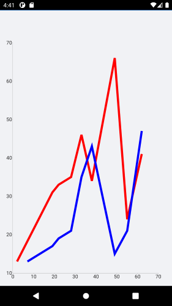

# ScatterLine Series

The ScatterLine Series are represented on the chart as data points connected with straight line segments. The ScatterLine Series inherit from the `[ScatterPointSeries]()` class and also require both axes of the chart to be Numerical Axes.

## Features

The ScatterLine Series provides the following properties to change its style:

- `Stroke` (Color)&mdash;Changes the color for drawing lines.
- `StrokeThickness` (double)&mdash;Changes the width of the lines.

## ScatterLine Series Example

The following example shows how to create a `RadCartesianChart` with a ScatterLine Series:

1. Create the needed business objects, for example:

 <snippet id='numerical-data-model' />

1. Create a `ViewModel`:

 <snippet id='chart-series-series-numerical-view-model' />


1. Use the following snippet to declare a `RadCartesianChart` with a ScatterLine Series in XAML:

 <snippet id='chart-series-scatterline-xaml' />


The following image shows the end result:



## Customization Example

The following example adds customizations to the ScatterLine Series by applying `Stroke` and `StrokeThickness` to the series.

```XAML
<telerik:RadCartesianChart>
    <telerik:RadCartesianChart.BindingContext>
        <local:SeriesNumericalViewModel />
    </telerik:RadCartesianChart.BindingContext>
    <telerik:RadCartesianChart.HorizontalAxis>
        <telerik:NumericalAxis LabelFitMode="MultiLine" />
    </telerik:RadCartesianChart.HorizontalAxis>
    <telerik:RadCartesianChart.VerticalAxis>
        <telerik:NumericalAxis />
    </telerik:RadCartesianChart.VerticalAxis>
    <telerik:RadCartesianChart.Series>
        <telerik:ScatterLineSeries XValueBinding="XData"
                                        YValueBinding="YData"
                                        Stroke="Red"
                                        StrokeThickness="5"
                                        ItemsSource="{Binding Data1}" />
        <telerik:ScatterLineSeries XValueBinding="XData"
                                        YValueBinding="YData"
                                        Stroke="Blue"
                                        StrokeThickness="5"
                                        ItemsSource="{Binding Data2}" />
    </telerik:RadCartesianChart.Series>
</telerik:RadCartesianChart>
```


The following image shows the final result:



## See Also

- [Line Series]()
- [ScatterPoint Series]()
- [Spline Series]()
