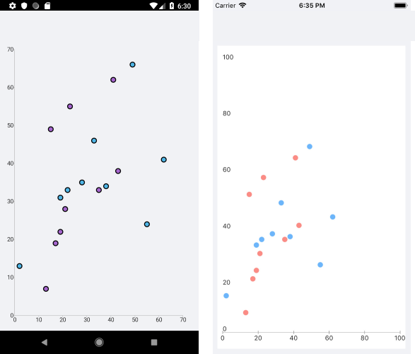

# ScatterPoint Series

The ScatterPoint Series are represented on the chart as data points that are not connected. Each scatter data point has to provide values for the X and Y coordinates on the `RadCartesianChart`. The ScatterPoint Series require both axes of the chart to be Numerical Axes.

## Features

The ScatterPoint Series provides the following properties:

- `XValueBinding`&mdash;Defines the binding that will be used to fill the `XValue` of the `ScatterDataPoint` members of the `DataPoints` collection.
- `YValueBinding`&mdash;Defines the binding that will be used to fill the `YValue` of the `ScatterDataPoint` members of the `DataPoints` collection.

## Example

The following example shows how to create a `RadCartesianChart` with a ScatterPoint Series:

1. First, create the needed business objects, for example:

 ```C#
public class NumericalData
{
    public double XData { get; set; }
    public double YData { get; set; }
}
 ```

1. Then, create a `ViewModel`:

 ```C#
public class SeriesNumericalViewModel
{
    public ObservableCollection<NumericalData> Data1 { get; set; }
    public ObservableCollection<NumericalData> Data2 { get; set; }

    public SeriesNumericalViewModel()
    {
        this.Data1 = GetNumericData1();
        this.Data2 = GetNumericData2();
    }

    public static ObservableCollection<NumericalData> GetNumericData1()
    {
        var data = new ObservableCollection<NumericalData>
        {
            new NumericalData { XData = 2, YData = 13 },
            new NumericalData { XData = 19, YData = 31 },
            new NumericalData { XData = 22, YData = 33 },
            new NumericalData { XData = 28, YData = 35 },
            new NumericalData { XData = 33, YData = 46 },
            new NumericalData { XData = 38, YData = 34 },
            new NumericalData { XData = 49, YData = 66 },
            new NumericalData { XData = 55, YData = 24 },
            new NumericalData { XData = 62, YData = 41 },
        };
        return data;
    }
    public static ObservableCollection<NumericalData> GetNumericData2()
    {
        var data = new ObservableCollection<NumericalData>
        {
            new NumericalData { XData = 7, YData = 13 },
            new NumericalData { XData = 19, YData = 17 },
            new NumericalData { XData = 22, YData = 19 },
            new NumericalData { XData = 28, YData = 21 },
            new NumericalData { XData = 33, YData = 35 },
            new NumericalData { XData = 38, YData = 43 },
            new NumericalData { XData = 49, YData = 15 },
            new NumericalData { XData = 55, YData = 21 },
            new NumericalData { XData = 62, YData = 47 },
        };
        return data;
    }
}
 ```

1. Finally, use the following snippet to declare a `RadCartesianChart` with a ScatterPoint Series in XAML and in C#:

 ```XAML
<telerikChart:RadCartesianChart PaletteName="LightSelected">
    <telerikChart:RadCartesianChart.BindingContext>
        <local:SeriesNumericalViewModel />
    </telerikChart:RadCartesianChart.BindingContext>
    <telerikChart:RadCartesianChart.HorizontalAxis>
        <telerikChart:NumericalAxis LabelFitMode="MultiLine" />
    </telerikChart:RadCartesianChart.HorizontalAxis>
    <telerikChart:RadCartesianChart.VerticalAxis>
        <telerikChart:NumericalAxis />
    </telerikChart:RadCartesianChart.VerticalAxis>
    <telerikChart:RadCartesianChart.Series>
        <telerikChart:ScatterPointSeries XValueBinding="XData"
                                         YValueBinding="YData"
                                         ItemsSource="{Binding Data1}" />
        <telerikChart:ScatterPointSeries XValueBinding="XData"
                                         YValueBinding="YData"
                                         ItemsSource="{Binding Data2}" />
    </telerikChart:RadCartesianChart.Series>
</telerikChart:RadCartesianChart>
 ```

The following image shows the end result:



## See Also

- [Line Series]()
- [ScatterLine Series]()
- [Spline Series]()
