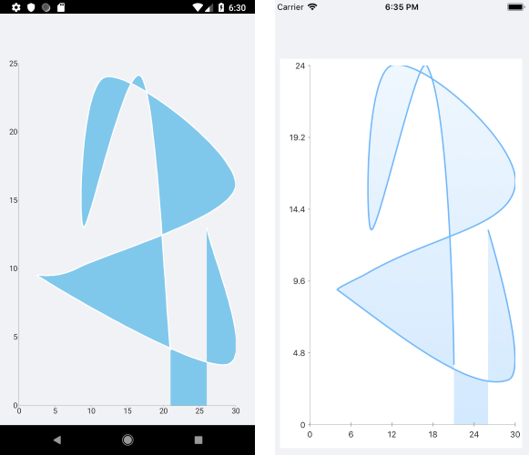

# ScatterSplineArea Series

The Cartesian Chart visualizes ScatterSplineArea Series as the area enclosed by the coordinate axes and curved line segments that connect the series data points. The ScatterSplineArea Series inherit from the [`ScatterPointSeries`]() class and also require both axes of the chart to be Numerical Axes.

## Features

The ScatterSplineArea Series provides the following properties:

- `XValueBinding`&mdash;Defines the binding that will be used to fill the `XValue` of the `ScatterDataPoint` members of the `DataPoints` collection.
- `YValueBinding`&mdash;Defines the binding that will be used to fill the `YValue` of the `ScatterDataPoint` members of the `DataPoints` collection.
- `Stroke` (Color)&mdash;Changes the color for drawing lines.
- `StrokeThickness` (double)&mdash;Changes the width of the lines.
- `Fill` (Color)&mdash;Changes the color for filling the area shapes.

## ScatterSplineArea Series Example

The following example shows how to create a `RadCartesianChart` with a ScatterSplineArea Series:

1. Create the needed business objects, for example:

 <snippet id='numerical-data-model' />


1. Ceate a `ViewModel`:

 <snippet id='chart-series-numerical-view-model' />


1. Usee the following snippet to declare a `RadCartesianChart` with a ScatterSplineArea Series in XAML:

 <snippet id='chart-series-scattersplinearea-xaml' />


The following image shows the end result:



## Customization Example

You can further customize the ScatterSplineArea Series:

```C#
	var series = new ScatterSplineAreaSeries
	{
		Stroke = new Color(0.6, 0.6, 0.9),
		StrokeThickness = 5,
		Fill = new Color(0.8, 0.8, 1)
	};
```

## See Also

- [Line Series]()
- [ScatterLine Series]()
- [Spline Series]()
