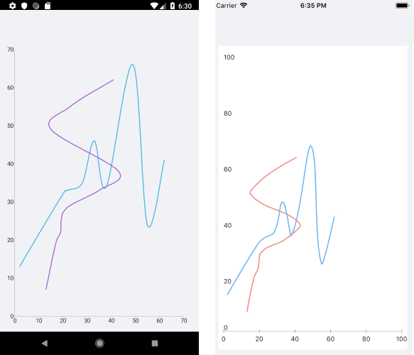

# ScatterSpline Series

The ScatterSpline Series are represented on the chart as data points connected with curved line segments. The ScatterSpline Series inherit from the [`ScatterPointSeries`]() class and also require both axes of the chart to be Numerical Axes.

## Features

The ScatterSpline Series provides the following properties:

- `Stroke` (Color)&mdash;Changes the color for drawing lines.
- `StrokeThickness` (double)&mdash;Changes the width of the lines.

## ScatterSpline Series Example

The following example shows how to create a `RadCartesianChart` with a ScatterSpline Series:

1. Create the needed business objects, for example:

 <snippet id='numerical-data-model' />


1. Create a `ViewModel`:

 <snippet id='chart-series-series-numerical-view-model' />


1. Use the following snippet to declare a `RadCartesianChart` with a ScatterSpline Series in XAML:

 <snippet id='chart-series-scatterspline-xaml' />


The following image shows the end result:



## Customization Example

You can further customize the ScatterSpline Series:

```C#
	var series = new ScatterSplineSeries
	{
		Stroke = new Color(0.6, 0.6, 0.9),
		StrokeThickness = 5
	};
```

## See Also

- [Line Series]()
- [ScatterLine Series]()
- [Spline Series]()
