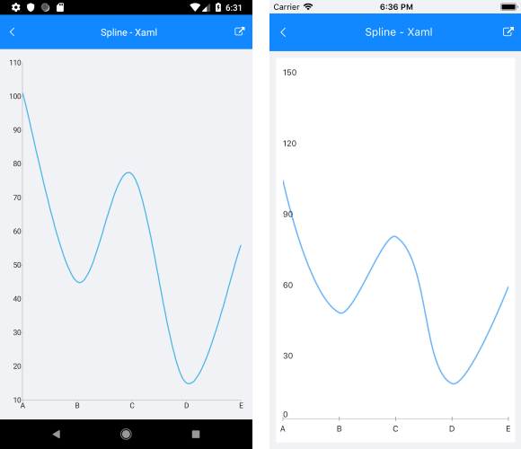
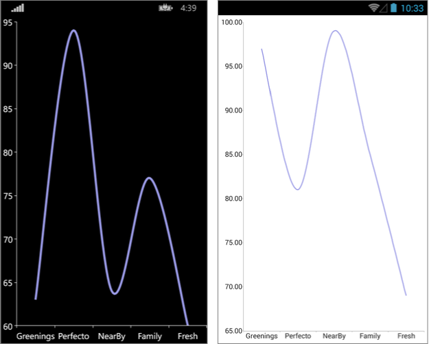

# Spline Series

## Overview

**RadCartesianChart** visualizes each data item from the **LineSeries** and connects them with curved line segments. The **SplineSeries** extend **LineSeries**, so they are also **CategoricalSeries** and require one **CategoricalAxis** and one **NumricalAxis**.

## Features

**SplineSeries** extend [**LineSeries**]() so they provide the same properties to change their style:

- **Stroke** (Color): changes the color used to draw lines.
- **StrokeThickness** (double): changes the width of the lines.

## Example

Here is an example how to create RadCartesianChart with Spline Series:

First, create the needed business objects, for example:

```C#
public class CategoricalData
{
    public object Category { get; set; }

    public double Value { get; set; }
}
```

Then create a ViewModel:

```C#
public class CategoricalDataViewModel
{
    public ObservableCollection<CategoricalData> Data { get; set; }

    public CategoricalDataViewModel()
    {
        this.Data = GetCategoricalData();
    }

    private static ObservableCollection<CategoricalData> GetCategoricalData()
    {
        var data = new ObservableCollection<CategoricalData>
        {
            new CategoricalData { Category = "A", Value = 101 },
            new CategoricalData { Category = "B", Value = 45 },
            new CategoricalData { Category = "C", Value = 77 },
            new CategoricalData { Category = "D", Value = 15 },
            new CategoricalData { Category = "E", Value = 56 },
        };
        return data;
    }
}
```

Finally, use the following snippet to declare a RadCartesianChart with Spline Series in XAML:

```XAML
<telerikChart:RadCartesianChart>
    <telerikChart:RadCartesianChart.BindingContext>
        <local:CategoricalDataViewModel />
    </telerikChart:RadCartesianChart.BindingContext>
    <telerikChart:RadCartesianChart.HorizontalAxis>
        <telerikChart:CategoricalAxis LabelFitMode="MultiLine"
                                      PlotMode="OnTicks" />
    </telerikChart:RadCartesianChart.HorizontalAxis>
    <telerikChart:RadCartesianChart.VerticalAxis>
        <telerikChart:NumericalAxis />
    </telerikChart:RadCartesianChart.VerticalAxis>
    <telerikChart:RadCartesianChart.Series>
        <telerikChart:SplineSeries ValueBinding="Value"
                                   CategoryBinding="Category"
                                   ItemsSource="{Binding Data}" />
    </telerikChart:RadCartesianChart.Series>
</telerikChart:RadCartesianChart>
```

And here is the result:



### Customization Example

Here we make some customization:

```C#
	var series = new SplineSeries 
	{ 
		Stroke = new Color(0.6, 0.6, 0.9), 
		StrokeThickness = 5 
	};
```



## See Also

- [ScatterArea Series]()
- [ScatterLine Series]()
- [ScatterPoint Series]()