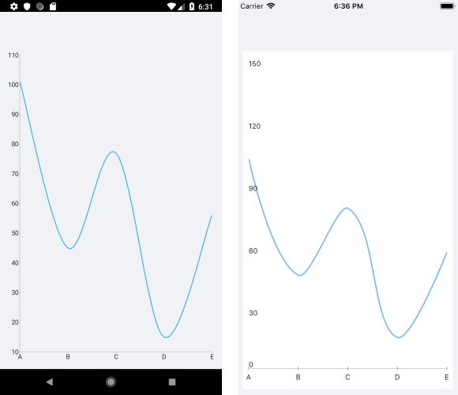

# Spline Series

The Cartesian Chart visualizes each data item from the Line Series and connects them with curved line segments. The Spline Series extend the [Line Series](), so they are also Categorical Series and require one Categorical Axis and one Numerical Axis.

## Features

The Spline Series extend the Line Series so they provide the same properties to change their style:

- `Stroke` (Color)&mdash;Changes the color for drawing lines.
- `StrokeThickness` (double)&mdash;Changes the width of the lines.

## Spline Series Example

The following example shows how to create a `RadCartesianChart` with a Spline Series:

1. Create the needed business objects, for example:

 <snippet id='categorical-data-model' />

1. Create a `ViewModel`:

 <snippet id='chart-series-categorical-data-view-model' />


1. Use the following snippet to declare a `RadCartesianChart` with a Spline Series in XAML:

 <snippet id='chart-series-spline-xaml' />


The following image shows the end result:



## Customization Example

You can further customize the Spline Series:

```C#
	var series = new SplineSeries
	{
		Stroke = new Color(0.6, 0.6, 0.9),
		StrokeThickness = 5
	};
```


## See Also

- [ScatterArea Series]()
- [ScatterLine Series]()
- [ScatterPoint Series]()
