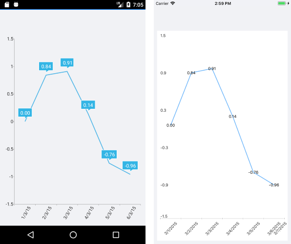

# Common Series Features

The `RadChart` exposes a number of features shared by the available Chart series.

## Data

* `ItemsSource`(`IList`)&mdash;Defines the data set that will fill the series data points.
* `DisplayName`(`string`)&mdash;The display name of the series.

## Selection

* `AllowSelect`(`bool`)&mdash;Specifies whether the series is selectable. If the property value is `true`, the selection is handled by the chart selection behavior.  
* `IsSelected`(`bool`)&mdash;Specifies whether the series is selected.

## Labels Customization

The Chart provides an option to display data point labels in the plot area through the `ShowLabels` property of the Chart Series.

To customize the series labels text, use the following properties:

* `ShowLabels`(`bool`)&mdash;Defines whether the series will display labels for each plotted data point.
* `LabelBinding`(`PropertyNameDataPointBinding`)&mdash;Allows the user to bind the series labels to a property of the data point item.
* `LabelFormat`(`string`)&mdash;Sets the label format string such as `"N"`, `"P2"`.
* `LabelFormatter`(`ILabelFormatter`)&mdash;Allows custom series label formatting.

**Label Customization Example**

The following example shows how to apply `LabelFormat` to a Line Series:

1. Create the business object:

 ```C#
public class TemporalData
{
    public DateTime Date { get; set; }

    public double Value { get; set; }
}
 ```

1. Create a `ViewModel`:

 ```C#
public class ViewModel
{
    public ObservableCollection<TemporalData> Data { get; set; }

    public ViewModel()
    {
        this.Data = GetDateTimeData(6);
    }

    private static ObservableCollection<TemporalData> GetDateTimeData(int itemsCount)
    {
        var startDate = new DateTime(2018, 03, 01);

        ObservableCollection<TemporalData> items = new ObservableCollection<TemporalData>();
        for (int i = 0; i < itemsCount; i++)
        {
            TemporalData data = new TemporalData();
            data.Date = startDate.AddDays(i);
            data.Value = Math.Sin(i);

            items.Add(data);
        }

        return items;
    }
}
 ```

1. Declare a `RadCartesianChart` with a Line Series in XAML:

 ```XAML
<telerikChart:RadCartesianChart x:Name="chart">
    <telerikChart:RadCartesianChart.BindingContext>
        <local:ViewModel />
    </telerikChart:RadCartesianChart.BindingContext>
    <telerikChart:RadCartesianChart.HorizontalAxis>
        <telerikChart:DateTimeContinuousAxis LabelFitMode="Rotate"
                                             MajorStepUnit="Day" />
    </telerikChart:RadCartesianChart.HorizontalAxis>
    <telerikChart:RadCartesianChart.VerticalAxis>
        <telerikChart:NumericalAxis Minimum="-1.5"
                                    Maximum="1.5" />
    </telerikChart:RadCartesianChart.VerticalAxis>
    <telerikChart:RadCartesianChart.Series>            
        <telerikChart:LineSeries ValueBinding="Value"
                                 CategoryBinding="Date"
                                 ItemsSource="{Binding Data}"
                                 ShowLabels="True"
                                 LabelFormat="{}{0:N2}"/>
</telerikChart:RadCartesianChart.Series>
 ```

The following image shows the end result:



>tip For detailed information about the supported numeric formats, refer to the [Standard Numeric Format Strings](https://docs.microsoft.com/en-us/dotnet/standard/base-types/standard-numeric-format-strings) article.

## Categorical Series Common Features

The Chart supports common features that are shared by its Categorical Series.  

### Data Binding

All categorical series have `CategoryBinding` and `ValueBinding` properties. These properties are of the `PropertyNameDataPointBinding` type and specify the name of the property from the data model used by the chart to plot the corresponding visual points.

### Combining

The categorical series have to be combined. For an example of the supported combining strategies, refer to the [section about the combining modes of the Chart]().

## Scatter Series Common Features

Scatter series provide the `XValueBinding` and `YValueBinding` properties for data binding to a view model. These properties are of the `PropertyNameDataPointBinding` type and specify the name of the property from the data model used by the chart to plot the corresponding visual points.

## See Also

- [Annotations]()
- [Chart Legend]()
- [Null Values]()
