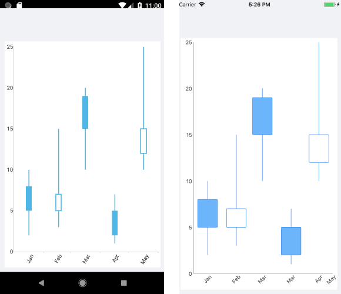

# Candlestick Series

The Cartesian Chart visualizes each data point from the Candlestick Series as a visual that resembles a candlestick. This is a typical financial series that can be used to visualize the state of a market for a period of time. The series operates with a special kind of data in the form of four parameters defining the stock market - **open**, **high**, **low**, and **close**. The **high** and **low** values show the price range (the highest and lowest prices) over one unit of time. The **open** and **close** values indicate the opening and closing price of the stock for the corresponding period

## Example

The following example shows how to create a basic `RadCartesianChart` with a Candlestick Series in XAML and C#.

1. Define the `RadCartesianChart`.

 <snippet id='chart-series-candlestick-xaml' />

1. Define the business model:

 <snippet id='chart-ohlc-datapoint-csharp' />

 1. And the ViewModel:

  <snippet id='chart-financial-indicator-viewmodel />

The following image shows the end result:

## See Also

- [Ohlc Series Overview]()
- [Financial Indicators]()
