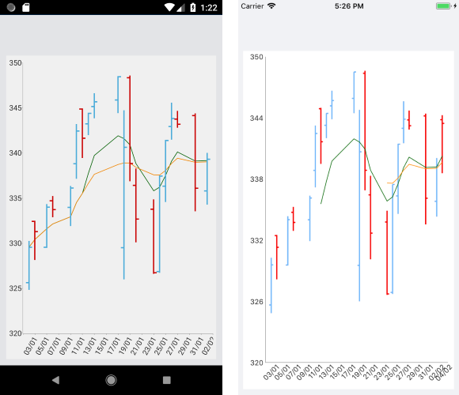

# .NET MAUI Chart Financial Indicators

The financial, or also called stock, indicators are mainly used for keeping track of stock prices and patterns of price changes over time. For more information about what indicators are and what their purpose is, refer to the [Short information about financial indicators](https://www.investopedia.com/terms/t/technicalindicator.asp) article.

In terms of using the indicators in the `RadCartesianChart`, you need to add them in the same way you add any other Cartesian series. Every indicator has a related formula by which it calculates the expected result. All you need to do is provide the needed data.

In terms of setting their properties and getting them ready for displaying your stock data, the financial indicators are two types:

* Indicators that have a category and a value binding (usually the **close** one) as well as one or more periods:  

  * `OscillatorIndicator`
  * `RateOfChangeIndicator`
  * `RelativeStrengthIndexIndicator`
  * `TrixIndicator`
  * `WeightedMovingAverageIndicator`
  * `ExponentialMovingAverageIndicator`
  * `AdaptiveMovingAverageKaufmanIndicator`
  * `BollingerBandsIndicator`
  * `RelativeMomentumIndexIndicator`
  * `MacdIndicator`

* Indicators that have a category and **high**, **low**, or **close** value bindings as well as none, one, or more periods:

  * `AverageTrueRangeIndicator`
  * `CommodityChannelIndexIndicator`
  * `StochasticFastIndicator`
  * `StochasticSlowIndicator`
  * `TrueRangeIndicator`
  * `UltimateOscillatorIndicator`

## Example

The following example shows how to create a basic `RadCartesianChart` with an OHLC Series and how to set a couple of `ExponentialMovingAverageIndicator` instances with different periods.

1. Define the `RadCartesianChart`.

 <snippet id='chart-series-indicators-xaml' />

1. Define the business model:

 <snippet id='chart-ohlc-datapoint-csharp' />

 1. And the ViewModel:

  <snippet id='chart-financial-indicator-viewmodel />

The following image shows the end result:

## See Also

- [Ohlc Series Overview]()
- [Candlestick Series Overview]()
