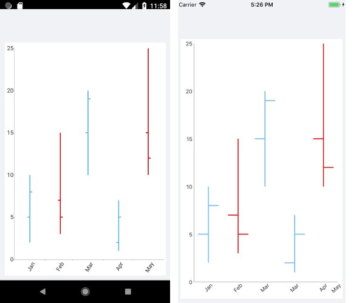

# OHLC Series

The Cartesian Chart visualizes each data point from the OHLC Series as a line with open and close value indicators on its side. This is a typical financial series that can be used to visualize the state of a market for a period of time. The OHLC Series operates with a special kind of data in the form of four parameters defining the stock market - **open**, **high**, **low**, and **close**. The **high** and **low** values show the price range (the highest and lowest prices) over one unit of time. The open and close values indicate the opening and closing price of the stock for the corresponding period

## Example

The following example shows how to create a basic `RadCartesianChart` with an OHLC Series in XAML and C#.

1. Define the Cartesian Chart.

 <snippet id='chart-series-ohlc-xaml' />

1. Define the business model:

 <snippet id='chart-ohlc-datapoint-csharp' />

 1. The ViewModel:

  <snippet id='chart-series-ohlc-viewmodel' />

The following image shows the end result:

## See Also

- [Candlestick Series Overview]()
- [Financial Indicators]()
