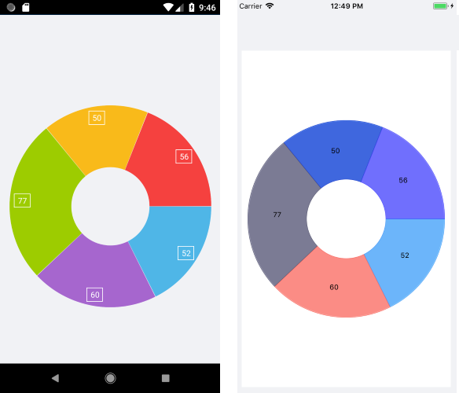

# Donut Series

The Pie Chart visualizes the Donut Series in the shape of a donut. The inner empty space is set according to the `InnerRadiusFactor` property. Each data item is visually represented by a donut slice. The ratio between the space consumed by each slice and the space consumed by the whole chart is the same as the ratio between the value of the data point that it represents and the total value of all data points in the series.

## Features

The Donut Series supports the following properties:

- `ValueBinding`&mdash;Defines the binding to a property of the data model that will be used to fill the pie slices.
- `RadiusFactor`&mdash;Specifies the radius factor used to calculate the radius of the visual series. This value is usually within the [0,1] range but it is possible to oversize the series by setting a value greater than `1`.
- `InnerRadiusFactor`&mdash;Specifies the radius factor used to calculate the radius of the inner empty space within the Donut visual element.
- `SelectedPointOffset`&mdash;Sets the offset applied to the currently selected point.

## Example

The following example shows how to create a basic `RadPieChart` with a Donut Series in XAML.

1. Define the `RadPieChart`:

```XAML
<telerikChart:RadPieChart>
    <telerikChart:RadPieChart.BindingContext>
        <local:ViewModel />
    </telerikChart:RadPieChart.BindingContext>
    <telerikChart:RadPieChart.Series>
        <telerikChart:DonutSeries ShowLabels="True"
                                  InnerRadiusFactor="0.4"
                                  ValueBinding="Value"
                                  ItemsSource="{Binding Data}" />
    </telerikChart:RadPieChart.Series>
</telerikChart:RadPieChart>
 ```

1. Define the business object exposing the following properties:

 ```C#
public class CategoricalData
{
    public object Category { get; set; }

    public double Value { get; set; }
}
 ```

1. Add a `ViewModel` class and some data:

 ```C#
public class ViewModel
{
    public ObservableCollection<CategoricalData> Data { get; set; }

    public ViewModel()
    {
        this.Data = GetCategoricalData();
    }

    private static ObservableCollection<CategoricalData> GetCategoricalData()
    {
        var data = new ObservableCollection<CategoricalData>
        {
            new CategoricalData { Category = "Greenings", Value = 52 },
            new CategoricalData { Category = "Perfecto", Value = 19 },
            new CategoricalData { Category = "NearBy", Value = 82 },
            new CategoricalData { Category = "Family", Value = 23 },
            new CategoricalData { Category = "Fresh", Value = 56 },
        };
        return data;
    }
}
 ```

The following image shows the end result.



## See Also

- [Pie Series Overview]()
- [Categorical Series Overview]()
