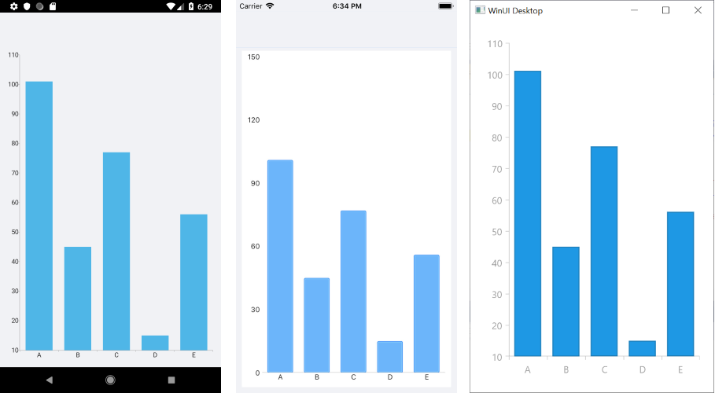

# Cartesian Chart

The Cartesian Chart visualizes its data points by using the Cartesian coordinate system. The X and Y axes define how the coordinates of each point in the plot area are calculated and the series type defines the way these data points will be visualized.  

## Properties

The Cartesian Chart supports the following properties:

* `HorizontalAxis` (`CartesianAxis`)—Gets or sets the visual `Axis` instance that will be used to plot points along the horizontal (X) axis.
* `VerticalAxis` (`CartesianAxis`)—Gets or sets the visual `Axis` instance that will be used to plot points along the vertical (Y) axis.
* `Series` (`ElementsCollection<CartesianSeries>`)&mdash;Gets a collection of all series presented by the chart instance.
* `Palette` (`ChartPalette`)&mdash;Gets or sets the `ChartPalette` instance that defines the appearance of the chart.
* `PaletteName` (`PaletteNames`)&mdash;Gets or sets the name of the predefined `Palette` that will be applied to the chart.
* `SelectionPalette` (`ChartPalette`)&mdash;Gets or sets the `ChartPalette` instance that defines the appearance of the chart for selected series and/or data points.
* `SelectionPaletteName` (`PaletteNames`)&mdash;Gets or sets the name of the predefined `SelectionPalette` that will be applied to the chart.
* `ChartBehaviors` (`ObservableCollection<ChartBehavior>`)&mdash;Gets a collection of all enabled behaviors.
* `Grid` (`CartesianChartGrid`)&mdash;Gets or sets the `CartesianChartGrid` instance used to decorate the chart plot area with grid and strip lines.
* `Annotations` (`ObservableCollection<CartesianChartAnnotation>`)&mdash;Gets a collection of all annotations presented by the chart instance.
* `MaxZoom` (`Size`)&mdash;Gets or sets the maximum allowed zoom.
* `Zoom` (Size zoom)&mdash;Gets or sets the zoom of the chart.
* `PanOffset` (Point offset)&mdash;Gets or sets an offset to the chart. Note that the offset will be specific for every platform depending on the values that the platform works with (absolute pixels or normed to the axis range) and the axis type.

## Axes

The Cartesian Chart requires two axes which are used to calculate correctly the position of each data point. Usually one of the axes is used to display the category of each data point and the other represents its value.

The following Cartesian Chart axes are available:

- [Categorical axis]()&mdash;Arranges the plotted data points in categories where the key of each category is the point’s value (if available) for that axis or its index within the points collection. The coordinate of the point, specified by this axis, is discrete and is calculated depending on the size of the category slot where the point resides.
- [Numerical axis]()&mdash;Calculates the coordinate of each data point, depending on the actual numerical value this point provides for the axis. Exposes the `Minimum` and `Maximum` properties to allow you to explicitly define the range of values visible on this axis. If these properties are not specified, the axis will automatically calculate the range depending on the minimum and maximum data point values.
- [Date-Time Continuous axis]()&mdash;A special axis that expects each data point to provide a `System.DateTime` structure as its value for this axis. Think of this axis as a time line where the coordinate of each data point is calculated depending on the position of its associated date and time on the time line. The base unit (or the step) of the axis is calculated depending on the smallest difference between any two dates.

## Series

The Cartesian Chart supports the Categorical, Scatter, and Financial series.

### Categorical Cartesian Chart Series

The categorical Cartesian Chart series require a [Numerical]() and a [Categorical]() or [Date-Time Continuous]() axes to get properly plotted.

The Categorical Cartesian Chart supports the following series:

- [Bar Series]()&mdash;Data points are represented by a box where the height (width) of the box is the distance between the numerical value of the point and the categorical axis that plots the point. Bars may be either horizontal or vertical depending on whether the categorical axis is specified as an `"X-axis"` or as a `"Y-axis"`.
- [Line Series]()&mdash;Data points are connected with straight line segments.
- [Spline Series]()&mdash;Data points are connected with smooth line segments.
- [Area Series]()&mdash;Data points and the corresponding coordinate axis enclose an area that may be optionally stroked and/or filled.
- [Spline Area Series]()&mdash;An area where points are connected with smooth rather than straight segments.

You can combine each of the above series of the same type in [stacks or clusters](). Combinations are formed when more than one data point from different series fall within the same category. The Cluster combine mode will position such points next to each other while the Stack combine mode will arrange such points in a stack-like structure. When stacks are formed, the numerical axis (if present) will consider each stack as a single entity and its sum will be the actual used value rather than the value of each point.

### Scatter Cartesian Chart Series

The Scatter Cartesian Charts Series require two Numerical axes to get properly plotted. Scattered data provides both the X and the Y coordinate.

The Scatter Cartesian Chart supports the following series:

- [Scatter Point Series]()&mdash;Data points are represented by an arbitrary template.
- [Scatter Line Series]()&mdash;Data points are connected with straight line segments.
- [Scatter Spline Series]()&mdash;Data points are connected with smooth line segments.
- [Scatter Area Series]()&mdash;Data points and the horizontal axis enclose an area that may be optionally stroked and/or filled.
- [Scatter Spline Area Series]()&mdash;A ScatterArea Chart where points are connected with smooth rather than straight segments.

### Financial Cartesian Chart Series

The Financial Cartesian Chart Series require a [Numerical]() and a [Date-Time Continuous]() or [Categorical]() axes to get properly plotted.

The Financial Cartesian Chart supports the following series:

- [OHLC Series]()&mdash;Each data point is visualized as a line with an **open** and **close** value indicators on its side.
- [Candlestick Series]()&mdash;Data points are plotted as visuals that resemble candlesticks.
- [Financial Indicators Series]()&mdash;The financial, or also called stock indicators, are mainly used for keeping track of stock prices and patterns of price changes over time.

## Example

1. Define the `RadCartesianChart`:

 ```XAML
<telerikChart:RadCartesianChart>
</telerikChart:RadCartesianChart>
 ```

1. The `RadCartesianChart` requires you to set a horizontal and a vertical axis to plot its data.

 ```XAML
<telerikChart:RadCartesianChart.HorizontalAxis>
	<telerikChart:CategoricalAxis/>
</telerikChart:RadCartesianChart.HorizontalAxis>
<telerikChart:RadCartesianChart.VerticalAxis>
	<telerikChart:NumericalAxis/>
</telerikChart:RadCartesianChart.VerticalAxis>
 ```

1. Now, add the series to the `RadCartesianChart.Series` collection:

 ```XAML
<telerikChart:RadCartesianChart>
	<telerikChart:RadCartesianChart.Series>
		<telerikChart:BarSeries ItemsSource="{Binding CategoricalData}">
			<telerikChart:BarSeries.ValueBinding>
				<telerikChart:PropertyNameDataPointBinding PropertyName="Value"/>
			</telerikChart:BarSeries.ValueBinding>
			<telerikChart:BarSeries.CategoryBinding>
				<telerikChart:PropertyNameDataPointBinding PropertyName="Category"/>
			</telerikChart:BarSeries.CategoryBinding>
		</telerikChart:BarSeries>
	</telerikChart:RadCartesianChart.Series>
</telerikChart:RadCartesianChart>
 ```

1. Set the `BindingContext` of the chart if none of its parents has a context:

 ```XAML
<telerikChart:RadCartesianChart.BindingContext>
	<local:ViewModel/>
</telerikChart:RadCartesianChart.BindingContext>
 ```

 In the example, `local` is defined as follows:

 ```XAML
xmlns:local="clr-namespace:[The namespace where the ViewModel class is defined];assembly=[The assembly name]"
 ```


## Cartesian Chart Example

The following example shows the full definition of the chart.

1. First, create the needed business object, for example:

 ```C#
public class CategoricalData
{
    public object Category { get; set; }

    public double Value { get; set; }
}
 ```

1. Then, create a `ViewModel`:

 ```C#
public class CategoricalDataViewModel
{
    public ObservableCollection<CategoricalData> Data { get; set; }

    public CategoricalDataViewModel()
    {
        this.Data = GetCategoricalData();
    }

    private static ObservableCollection<CategoricalData> GetCategoricalData()
    {
        var data = new ObservableCollection<CategoricalData>
        {
            new CategoricalData { Category = "A", Value = 101 },
            new CategoricalData { Category = "B", Value = 45 },
            new CategoricalData { Category = "C", Value = 77 },
            new CategoricalData { Category = "D", Value = 15 },
            new CategoricalData { Category = "E", Value = 56 },
        };
        return data;
    }
}
 ```

1. Declare the chart in XAML:

 ```XAML
<telerikChart:RadCartesianChart>
    <telerikChart:RadCartesianChart.BindingContext>
        <local:CategoricalDataViewModel />
    </telerikChart:RadCartesianChart.BindingContext>
    <telerikChart:RadCartesianChart.HorizontalAxis>
        <telerikChart:CategoricalAxis LabelFitMode="MultiLine" />
    </telerikChart:RadCartesianChart.HorizontalAxis>
    <telerikChart:RadCartesianChart.VerticalAxis>
        <telerikChart:NumericalAxis LabelFitMode="MultiLine" />
    </telerikChart:RadCartesianChart.VerticalAxis>
    <telerikChart:RadCartesianChart.Series>
        <telerikChart:BarSeries ValueBinding="Value"
                                CategoryBinding="Category"
                                ItemsSource="{Binding Data}" />
    </telerikChart:RadCartesianChart.Series>
</telerikChart:RadCartesianChart>
 ```


The following image shows the final result:



## See Also

- [Pie Chart]()
- [Chart Legend]()
- [Chart Null Values]()
