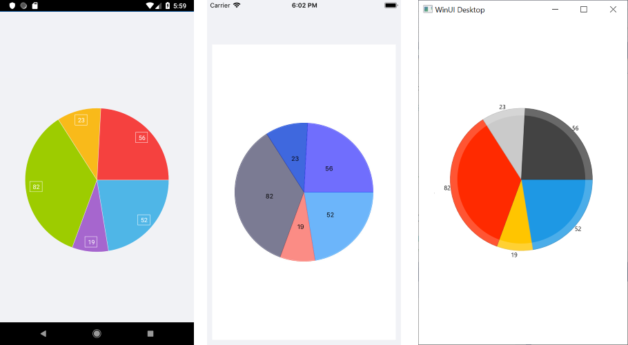

# .NET MAUI Pie Chart

The Pie Chart visualizes its data points by using the radial coordinate system. Each data point is represented as a slice from a pie. The ratio between the space consumed by each slice and the space consumed by the whole chart is the same as the ratio between the value of the data point that it represents and the total value of all data points in the series.

## Properties

The Pie Chart supports the following properties:

* `Series`&mdash;Gets a collection of all series presented by the chart instance.
* `Behaviors`&mdash;Gets a collection of all enabled behaviors.
* `Palette`&mdash;Gets or sets the `ChartPalette` instance that defines the appearance of the chart.
* `PaletteName`&mdash;Gets or sets the name of the predefined `Palette` that will be applied to the chart.
* `SelectionPalette`&mdash;Gets or sets the `ChartPalette` instance that defines the appearance of the chart for the selected series and/or data points.
* `SelectionPaletteName`&mdash;Gets or sets the name of the predefined `SelectionPalette` that will be applied to the chart.

## Series

The Pie Chart supports the Pie Series, which visualize a single series of data in a pie chart. The sweep of a pie slice is directly proportional to the magnitude of the data point values.

## Example

1. Define the `RadPieChart`:  

 ```XAML
<telerik:RadPieChart>
</telerik:RadPieChart>
 ```

1. Add the series to the `RadPieChart.Series` collection:

 ```XAML
<telerik:RadPieChart.Series>
	<telerik:PieSeries ItemsSource="{Binding Data}">
		<telerik:PieSeries.ValueBinding>
			<telerik:PropertyNameDataPointBinding PropertyName="Value"/>
		</telerik:PieSeries.ValueBinding>
	</telerik:PieSeries>
</telerik:RadPieChart.Series>
 ```

1. Set the `BindingContext` of the chart if none of its parents has a context:

 ```XAML
<telerik:RadPieChart.BindingContext>
	<local:ViewModel/>
</telerik:RadPieChart.BindingContext>
```


## Pie Chart Example

The following example shows the full definition of the chart.

1. First, create the needed business object, for example:

 <snippet id='categorical-data-model' />


1. Then, create a `ViewModel`:

 <snippet id='chart-piechart-view-model' />


1. Finally, declare a `RadPieChart` with a Pie Series in XAML:

 <snippet id='chart-piechart-xaml' />


The following image shows the end result:



## See Also

- [Cartesian Chart]()
- [Chart Legend]()
- [Chart Null Values]()
