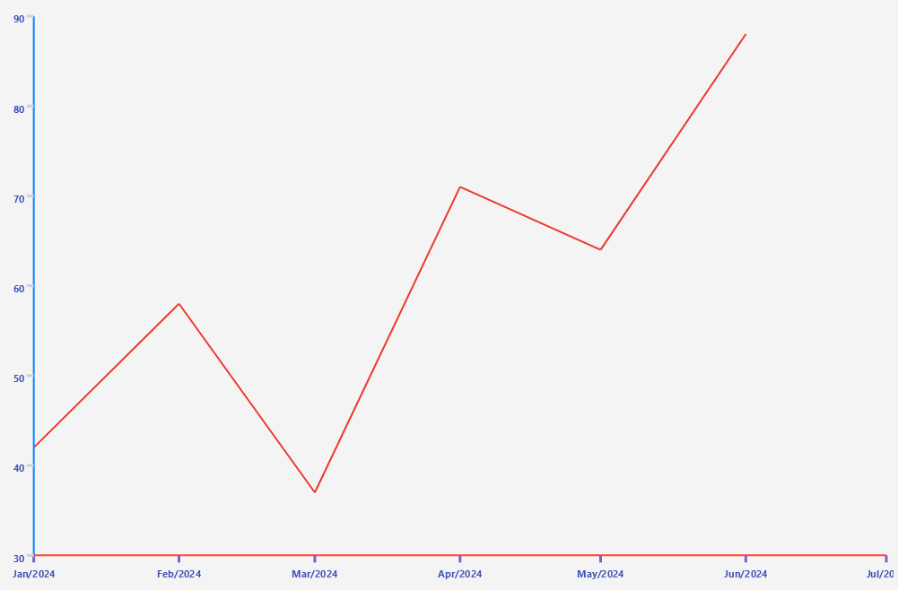

# .NET MAUI Cartesian Chart Date-Time Axis

The `DateTimeAxis` positions the data points on a time line depending on a `System.DateTime` value. Instead of treating each value as an isolated category, the axis builds time slots based on its range and step, which allows it to display empty time slots when no data exists for a given interval.

You define the axis through the `Axes` collection of the `RadCartesianChart`.

## Axis Location

Use the `Location` (enum of type `Telerik.Maui.Controls.Charts.ChartAxisLocation`) property to specify the axis location. The available options are `Left`, `Right`, `Top`, or `Bottom`.

## Line Styling

Use the following properties to customize the appearance of the axis line:

* `LineColor` (`Color`)&mdash;Defines the color of the axis line.
* `LineThickness` (`double`)&mdash;Defines the thickness of the axis line.

## Range and Ticks

Use the following properties to control the time line range, the interval between ticks, and their appearance:

* `Minimum` (`DateTime`)&mdash;Defines the minimum value of the axis range.
* `Maximum` (`DateTime`)&mdash;Defines the maximum value of the axis range.
* `MajorStep` (`double`)&mdash;Defines the interval between adjacent ticks.
* `MajorStepUnit` (`Telerik.Maui.Controls.Charts.ChartTimeInterval`)&mdash;Defines which `DateTime` component the `MajorStep` value refers to: `None`,`Year`, `Quarter`, `Month`, `Week`, `Day`, `Hour`, `Minute`, `Second`, or `Millisecond`. The default value is `None`, so the chart engine choose both the unit and the step automatically based on the axis range and `DesiredTickCount`.
* `WeekStartDay` (`DayOfWeek`)&mdash;Defines the first day of the week when the `MajorStepUnit` is set to `Week`. The default value is `Monday`.
* `DesiredTickCount` (`int`)&mdash;Defines the number of ticks the axis renders.
* `MajorTickColor` (`Color`)&mdash;Defines the color of the major ticks.
* `MajorTickThickness` (`double`)&mdash;Defines the thickness of the major ticks.
* `MajorTickLength` (`double`)&mdash;Defines the length of the major ticks.

## Labels Styling

Use the following properties for configuring the axis labels and their appearance:

* `LabelFormat` (`string`)&mdash;Defines the format string that is applied to the axis labels, for example `"dd-MM-yy"` or `"HH:mm"`.
* `ShowLabels` (`bool`)&mdash;Defines whether the axis displays labels.
* `LabelStyle` (`Style` with target type `ChartLabelAppearance`)&mdash;Defines the style of the axis labels.
* `LabelInterval` (`int`)&mdash;Defines the step at which the axis renders labels.

## Example

The following example shows how to define a `DateTimeAxis` with a custom step and label format.

1. Define the `DateTimeAxis` as the horizontal axis of the chart.
 
<snippet id='chart-cartesian-datetime-axis-xaml' />

2. Add the `charts` namespace:
 
```XAML
xmlns:charts="clr-namespace:Telerik.Maui.Controls.Charts;assembly=Telerik.Maui.Controls"
```

3. Add the data model:

<snippet id='chart-datamodel-datetime' />

4. Add the `ViewModel`:

<snippet id='chart-datetime-viewmodel' />

This is the result:



> For runnable examples with the Cartesian Chart axes, go to the [SDKBrowser Demo Application]() and navigate to the **Charts > Axes** category.

## See Also

- [Categorical Axis]()
- [Grid Lines]()
