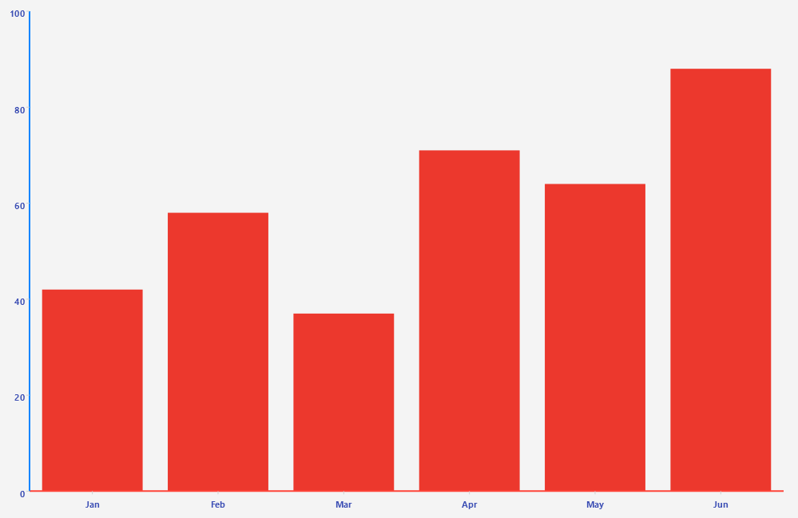

# .NET MAUI Cartesian Chart Numerical Axis

The `NumericalAxis` positions the data points depending on their numerical value. It builds a numerical range&mdash;either user-defined or automatically calculated&mdash;and determines the coordinate of each data point along the axis.

You define the axis through the `HorizontalAxis`, the `VerticalAxis`, or the `Axes` collection of the `RadCartesianChart`.

## Axis Location

Use the `Location` (enum of type `Telerik.Maui.Controls.Charts.ChartAxisLocation`) property to specify the axis location. The available options are `Left`, `Right`, `Top`, or `Bottom`.

## Line Styling

Use the following properties to customize the appearance of the axis line:

* `LineColor` (`Color`)&mdash;Defines the color of the axis line.
* `LineThickness` (`double`)&mdash;Defines the thickness of the axis line.

## Range and Ticks

Use the following properties to control the range and the ticks of the axis:

* `Minimum` (`double`)&mdash;Gets or sets the minimum value of the axis. By default, the axis calculates the minimum from the smallest value of the plotted data points.
* `Maximum` (`double`)&mdash;Gets or sets the maximum value of the axis. By default, the axis calculates the maximum from the largest value of the plotted data points.
* `DesiredTickCount` (`int`)&mdash;Gets or sets the number of ticks that the axis renders.
* `MajorTickColor` (`Color`)&mdash;Defines the color of the major ticks.
* `MajorTickThickness` (`double`)&mdash;Defines the thickness of the major ticks.
* `MajorTickLength` (`double`)&mdash;Defines the length of the major ticks.

## Labels Customization

The Numerical Axis exposes the following properties for configuring the labels and their appearance:

* `ShowLabels` (`bool`)&mdash;Defines whether the axis labels will be displayed.
* `LabelStyle` (`Style`)&mdash;Defines the style, targeting `ChartLabelAppearance`, that applies to the axis labels.
* `LabelInterval` (`int`)&mdash;Defines the step at which the axis renders labels.

## Example

The following example shows how to define a `NumericalAxis` with an explicit range and tick count.

<snippet id=''chart-cartesian-numerical-axis-xaml'' />

> For runnable examples with the Cartesian Chart axes, go to the [SDKBrowser Demo Application]() and navigate to the **Chart > Axes** category.

## See Also

- [Categorical Axis]()
- [Grid Lines]()
