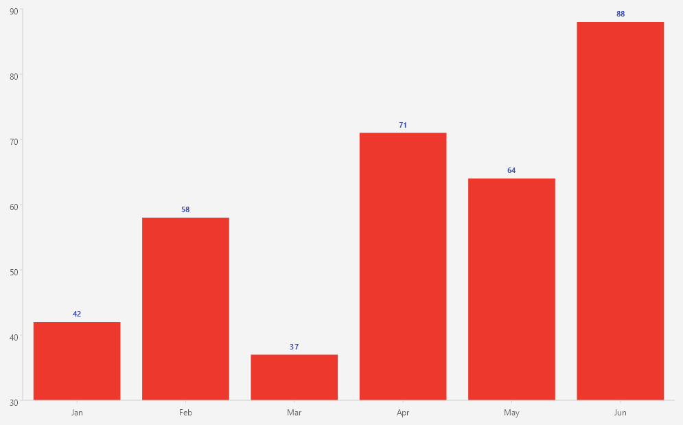

# .NET MAUI CartesianChart Data Point Labels

The Telerik UI for .NET MAUI CartesianChart can display labels for the individual data points of a series. The labels annotate each data point with its value directly in the plot area.

## Configuration

To configure the data point labels, use the following properties of the series:

* `ShowLabels` (`bool`)&mdashDefines whether the series displays labels for its data points.
* `LabelStyle` (`Style` with target type `ChartLabelAppearance`)&mdash;Defines the style of the series labels.
* `LabelOffset` (`Microsoft.Maui.Graphics.Point`)&mdash;Defines the offset that is applied to the position of each label.

The `ChartLabelAppearance` style exposes appearance properties such as `TextColor`, `FontSize`, `FontFamily` and `FontAttributes`.

## Example

The following example demonstrates how to display customized labels for a `BarSeries`.

1. Define the `BarSeries` in XAML and set the `ShowLabels` property to `True`. Then, define a style for the labels and set it to the `LabelStyle` property of the series.

<snippet id='chart-cartesian-data-point-labels-xaml' />

2. Add the `charts` namespace:

```XAML
xmlns:charts="clr-namespace:Telerik.Maui.Controls.Charts;assembly=Telerik.Maui.Controls"
```

3. Define the data model:

<snippet id='chart-datamodel-categorical-data' />

4. Define the `ViewModel`:

<snippet id='chart-categorical-viewmodel' />

This is the result:



> For a runnable example with the Cartesian Chart Data Point Labels scenario, go to the [SDKBrowser Demo Application]() and navigate to the **Charts > Features** category.

## See Also

- [Cartesian Chart Series]()
- [Grid Lines]()
