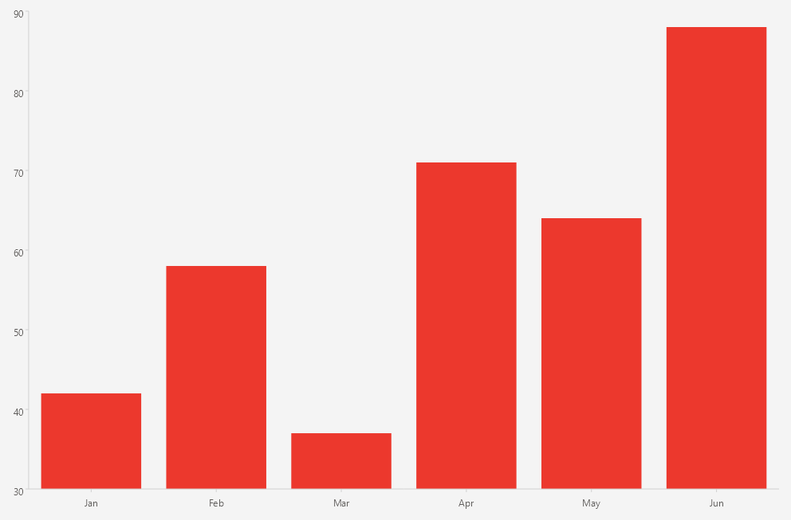

# Getting Started with the .NET MAUI CartesianChart

This guide provides the information you need to start using the Telerik UI for [.NET MAUI CartesianChart]() by adding the control to your project.

At the end, you will be able to achieve the following result.



## Prerequisites

Before adding the CartesianChart, you need to:

1. [Set up your .NET MAUI application](#prerequisites).

1. [Download Telerik UI for .NET MAUI](#step-2-download-your-license-key-file).

1. [Install Telerik UI for .NET MAUI](#step-3-create-a-new-maui-project).

## Define the Control

1. When your .NET MAUI application is set up, you are ready to add a `RadCartesianChart` to your page. The following example defines a chart with a `CategoricalAxis`, a `NumericalAxis`, and a `BarSeries`:

    <snippet id='chart-cartesian-getting-started-xaml' />

2. Add the `chart` namespace:

    ```XAML
    xmlns:charts="clr-namespace:Telerik.Maui.Controls.Charts;assembly=Telerik.Maui.Controls"
    ```

3. Register the Telerik controls through the `Telerik.Maui.Controls.Compatibility.UseTelerik` extension method called inside the `CreateMauiApp` method of the `MauiProgram.cs` file of your project:

    ```C#
    using Telerik.Maui.Controls.Compatibility;

    public static class MauiProgram
    {
        public static MauiApp CreateMauiApp()
        {
            var builder = MauiApp.CreateBuilder();
            builder
                .UseTelerik()
                .UseMauiApp<App>()
                .ConfigureFonts(fonts =>
                {
                    fonts.AddFont("OpenSans-Regular.ttf", "OpenSansRegular");
                });
            return builder.Build();
        }
    }
    ```

The `BarSeries` binds to a collection of items through its `ItemsSource` property, while the `HorizontalBinding` and `VerticalBinding` properties define which data-item members supply the category and the value of each data point.

> For a runnable example with the CartesianChart Getting Started scenario, go to the [SDKBrowser Demo Application]() and navigate to the **Charts > Getting Started** category.

## Additional Resources

- [.NET MAUI CartesianChart Categorical Axis]()
- [.NET MAUI CartesianChart Numerical Axis]()
- [.NET MAUI CartesianChart Date-Time Axis]()
- [.NET MAUI Charts Product Page](https://www.telerik.com/maui-ui/charts)
- [.NET MAUI Charts Forum Page](https://www.telerik.com/forums/maui)

## See Also

- [Categorical Axis]()
- [CartesianChart Visual Structure]()
