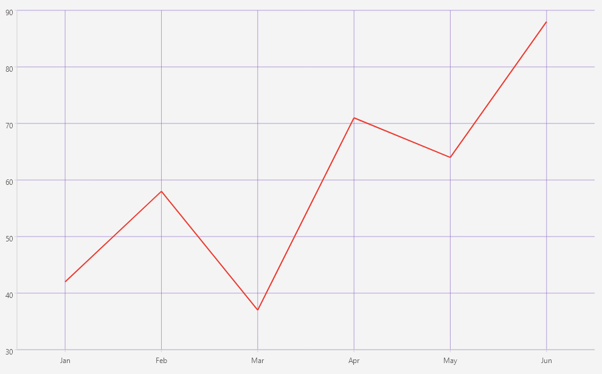

# .NET MAUI Cartesian Chart Grid Lines

The Telerik UI for .NET MAUI Cartesian Chart can decorate its plot area with grid lines that improve the readability of the plotted data. You configure the grid lines through the `Grid` property of the `RadCartesianChart`, which accepts a `CartesianChartGrid` instance.

## Configuration

To configure the grid lines, use the following properties of the `CartesianChartGrid`:

* `MajorLinesVisibility` (`Telerik.Maui.Controls.Charts.ChartGridLinesVisibility`)&mdash;Defines which major grid lines are visible. The available values are `None`, `Horizontal`, `Vertical`, and `Both`. The default value is `Both`.
* `MajorLineThickness` (`double`)&mdash;Defines the thickness of the major grid lines. The default value is `1`.
* `MajorLineColor` (`Color`)&mdash;Defines the color of the major grid lines.

## Example

The following example demonstrates how to display both horizontal and vertical grid lines.

1. Add the `RadCartesianChart` to your XAML page and configure the grid lines:

<snippet id='chart-cartesian-grid-lines-xaml' />

2. Add the `charts` namespace:

```XAML
xmlns:charts="clr-namespace:Telerik.Maui.Controls.Charts;assembly=Telerik.Maui.Controls"
```

3. Define the data model:

<snippet id='chart-datamodel-categorical-data' />

4. Define the `ViewModel`:

<snippet id='chart-categorical-viewmodel' />

This is the result:



> For a runnable example with the CartesianChart Grid Lines scenario, go to the [SDKBrowser Demo Application]() and navigate to the **Charts > Features** category.

## See Also

- [Categorical Axis]()
- [Numerical Axis]()
- [Date-Time Axis]()
- [Data Point Labels]()
